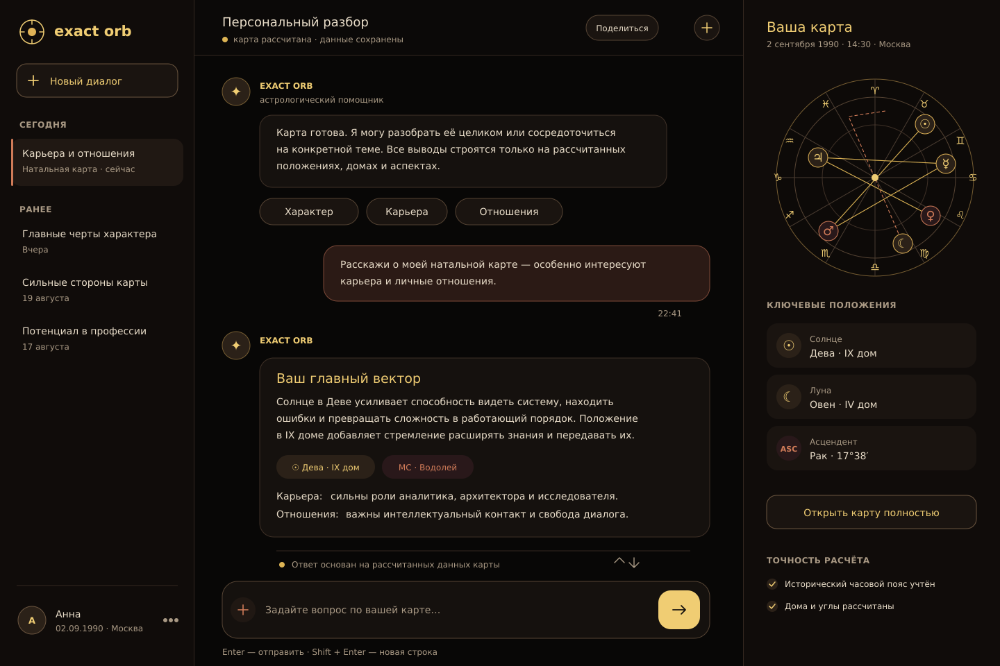
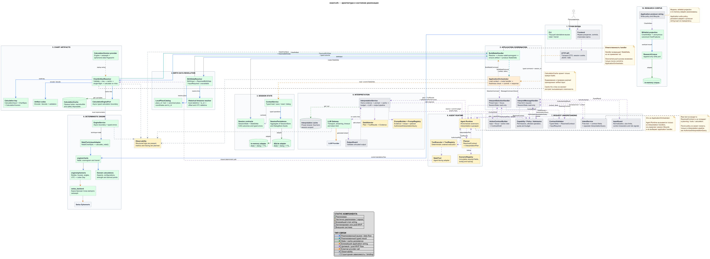

# exact-orb

> **Исследовательский проект. Не продукт, не сервис, не коммерческое предложение.**
>
> **Предмет исследования — управляемая разработка с AI-агентами** и архитектура систем,
> в которых языковая модель работает поверх проверяемых фактов, но не создаёт их.
>
> **Предметная область взята как инженерный case study.** Расчёт астрологических карт
> выбран потому, что даёт редкое сочетание: строго вычислимый источник фактов рядом
> с задачей, которую естественно решать языковой моделью. Проект не исследует
> и не утверждает научную валидность астрологии, не оказывает услуг и никому
> ничего не предсказывает.
>
> Читать этот репозиторий имеет смысл как отчёт об эксперименте: требования,
> архитектурные решения, границы компонентов, тесты и разборы собственных ошибок.

`Python 3.11+` · `Swiss Ephemeris` · `AGPL-3.0` · активная R&D-разработка

---

## Оглавление

- [О проекте](#о-проекте)
- [Что исследует проект](#что-исследует-проект)
  - [Детерминированное ядро + LLM](#детерминированное-ядро--llm)
  - [Управляемая разработка с AI-агентами](#управляемая-разработка-с-ai-агентами)
- [Инженерные принципы](#инженерные-принципы)
- [Текущее состояние](#текущее-состояние)
  - [Целевой интерфейс](#целевой-интерфейс)
- [Быстрый старт](#быстрый-старт)
- [Пример результата](#пример-результата)
- [Архитектура](#архитектура)
  - [Текущий application slice](#текущий-application-slice)
  - [Каталог мест](#каталог-мест)
  - [Детерминированный расчёт](#детерминированный-расчёт)
  - [Неизвестное время рождения](#неизвестное-время-рождения)
  - [Calculation identity и воспроизводимость](#calculation-identity-и-воспроизводимость)
  - [Lifecycle chart artifact](#lifecycle-chart-artifact)
  - [Предметная модель аспектов](#предметная-модель-аспектов)
  - [Session model](#session-model)
  - [Детерминированный path и Agent Runtime](#детерминированный-path-и-agent-runtime)
  - [Research corpus](#research-corpus)
  - [Observability](#observability)
- [Архитектура как исполняемое ограничение](#архитектура-как-исполняемое-ограничение)
- [Метод разработки](#метод-разработки)
  - [Human decision ownership](#human-decision-ownership)
  - [Prompt не является source of truth](#prompt-не-является-source-of-truth)
  - [Дефекты возвращаются в specification layer](#дефекты-возвращаются-в-specification-layer)
- [Дефекты, найденные человеком](#дефекты-найденные-человеком)
- [Стратегия тестирования](#стратегия-тестирования)
- [Известные ограничения](#известные-ограничения)
- [Документация](#документация)
- [Структура репозитория](#структура-репозитория)
- [Что дальше](#что-дальше)
- [Лицензия](#лицензия)

---

## О проекте

**exact-orb — R&D-проект об управляемой разработке с AI-агентами.**

Проект исследует, насколько далеко специалист, отвечающий за требования,
архитектурные решения и качество, может масштабировать разработку программного продукта,
делегируя AI-агентам написание кода и часть технической проработки.

Цель — показать не только результат такой разработки, но и инженерную control model,
необходимую для сохранения управляемости:

- формализацию требований;
- архитектурные решения;
- явные контракты и границы ответственности компонентов;
- проектирование позитивных, негативных и concurrency-сценариев;
- автоматизированные тесты;
- исполняемые архитектурные ограничения;
- последовательную проверку результатов работы агентов человеком и детерминированными средствами.

Предметная область выбрана как инженерный полигон. Расчёт астрологических карт позволяет
на конкретном примере соединить два принципиально разных типа обработки:

- **детерминированный расчёт** — воспроизводимые положения, дома, аспекты,
  конфигурации и другие вычисляемые факты;
- **вероятностную интерпретацию** — работу LLM с естественным языком поверх уже
  рассчитанных и проверенных данных.

Проект остаётся открытым: выбранная область позволяет публиковать исходный код,
требования, архитектурные решения, тестовые сценарии и результаты экспериментов без
раскрытия корпоративных данных или внутренней бизнес-логики.

Тот же архитектурный контур — детерминированный источник фактов, явные контракты
на границах и вероятностный слой строго за ними — применим к любой области, где ошибка
языковой модели в фактах недопустима.

Астрология здесь заменяема. Исследовательский интерес представляет не сама предметная
область, а архитектура системы и процесс **controlled human–AI software development**.

---

## Что исследует проект

У проекта две связанные исследовательские линии.

### Детерминированное ядро + LLM

Главный архитектурный принцип:

> **LLM не является источником расчётных фактов.**

Положения небесных тел, дома, аспекты, конфигурации и другие вычисляемые показатели
появляются только в результате детерминированного расчёта.

Языковая модель может интерпретировать и объяснять рассчитанные данные, но не должна
самостоятельно достраивать отсутствующие факты карты.

```text
structured input
      │
      ▼
deterministic resolution
      │
      ▼
deterministic calculation
      │
      ▼
validated chart artifact
      │
      ▼
evidence selection
      │
      ▼
LLM interpretation
```

### Управляемая разработка с AI-агентами

Вторая линия эксперимента — процесс создания самого проекта.

LLM используется как инструмент анализа и исполнения в нескольких ограниченных ролях:

- исследование архитектурных альтернатив;
- разбор corner cases;
- проверка выбранного решения на противоречия и скрытые последствия;
- формализация принятых владельцем решений в требования, ADR и диаграммы;
- подготовка bounded implementation tasks;
- написание кода в заданных архитектурных и функциональных границах;
- отдельный review реализации против требований;
- проектирование regression-сценариев для найденных дефектов.

> **LLM расширяет пространство анализа и ускоряет реализацию, но не определяет
> продуктовую семантику и не принимает архитектурные решения.**

Владелец проекта формулирует проблему и ограничения, выбирает между альтернативами,
определяет допустимое поведение в спорных сценариях, утверждает спецификацию и принимает
итоговую реализацию.

Полное описание процесса:
[`docs/development_approach/spec-driven-development.md`](docs/development_approach/spec-driven-development.md)

---

## Инженерные принципы

- **Детерминированное ядро.** Одинаковый вход, версия расчёта и набор эфемерид дают одинаковый результат.
- **LLM работает с evidence.** Вероятностный слой объясняет подготовленные системой факты, но не создаёт их.
- **Явные границы компонентов.** Resolution, calculation, artifact/cache lifecycle, application coordination, session state и agent execution разделены.
- **Типизированные контракты.** На границах используются commands, outcomes, ports, specifications и state deltas.
- **Архитектурные правила по возможности исполняемы.**
- **Дефект становится regression-тестом.**
- **Минимальный scope изменения.** Implementation task не является разрешением на сопутствующий рефакторинг.
- **Неопределённость моделируется явно.** Система не должна скрывать неизвестные или технически подставленные значения как точные пользовательские данные.

---

## Текущее состояние

`exact-orb` находится в активной R&D-разработке.

Это **ещё не полноценное web-приложение**.

Первый детерминированный application use case — построение натальной карты или
космограммы — реализован через отдельные application-контракты и реальные границы
компонентов.

| Область | Состояние |
|---|---|
| Детерминированный engine | **Реализован** |
| Расчёт натальной карты | **Реализован** |
| Космограмма / неизвестное время рождения | **Реализовано в текущем application calculation path** |
| Низкоуровневый расчёт транзитов | **Реализован в `engine/`** |
| Аспекты и конфигурации аспектов | **Реализованы**; семантика пересмотрена ADR-0029…0032 |
| Сила, достоинства и диспозиторы | **Реализованы**; ADR-0033 |
| Resolution данных рождения | **Реализован** |
| `ChartSpec` и calculation identity | **Реализованы** |
| Calculation-version fingerprint | **Реализован** |
| Chart artifact cache / codec / validation | **Реализованы** |
| Process-local single-flight | **Реализован** |
| `BuildNatalHandler` | **Реализован и интеграционно протестирован** |
| Session contracts и `ContextService` | **Реализованы** |
| In-memory session persistence | **Реализован** |
| SQLite session persistence | **Реализован** |
| Research feature projection | **Реализован** |
| Research in-memory corpus | **Реализован** |
| LLM gateway | **Реализован как инфраструктурный слой** |
| Interpretation / agent orchestration | Пока только каркас |
| Application Orchestrator | **Реализован; принят на реальном стеке** |
| Application composition | **Process-local runtime реализован и принят**: resolver, cache, engine, SQLite, `CalculationVersion`, `ContextService` и Orchestrator |
| Каталог мест | **M1-5 core реализован и принят**: deterministic SQLite builder, `PlaceSearch`, search/lookup и интеграция с `BirthDataResolver`; HTTP/UI/deployment остаются M1-6/M1-7/M1-12 |
| Публичный HTTP API | Пока не реализован |
| Web UI | Пока не реализован |

Важно различать два уровня готовности. Низкоуровневый движок уже содержит расчёт
транзитов, но текущий application calculation service обслуживает базовый сценарий
натальной карты / космограммы. Поэтому полноценный transit application flow
не заявляется как завершённый.

### Целевой интерфейс

[Раздел UI/UX](docs/ui_ux/README.md) содержит требования, открытые решения и рендеры.
[Интерактивный web-прототип](docs/ui_ux/web-prototype.html) показывает экраны на
демонстрационных данных. **Все материалы раздела имеют статус черновика.**
Изображение ниже показывает желаемый конечный вид; Web UI пока не реализован.



---

## Быстрый старт

Требуется **Python 3.11+**.

```bash
git clone https://github.com/ksenia-baranova/exact-orb-demo.git
cd exact-orb-demo

python -m venv .venv
```

Linux / macOS:

```bash
source .venv/bin/activate
```

Windows:

```powershell
.venv\Scripts\Activate.ps1
```

Установка и запуск:

```bash
pip install -e .            # для разработки: pip install -e ".[dev]"
exact-orb --help
pytest
```

Расчёт карты:

```bash
exact-orb "02.09.1985 00.45 gmt+4" \
  --lat 55.7522 \
  --lon 37.6155 \
  --place "Moscow"
```

JSON-вывод — тот же вызов с `--format json`.

CLI предназначен прежде всего для прямого запуска calculation engine.
Он **пока не проходит через реализованный Application Orchestrator** и не является демонстрацией
application-handler lifecycle.

---

## Пример результата

Фрагмент human-readable вывода для карты из примера выше.
Полный эталон — [`tests/golden/natal_1985_human.txt`](tests/golden/natal_1985_human.txt).

```text
НАТАЛЬНАЯ КАРТА
2 сентября 1985, 00:45 (+04:00) · Москва 55.75N 37.62E · Плацидус

ПЛАНЕТЫ
  Солнце      Дева        09°20'27"    4 дом
  Луна        Овен        07°39'54"   11 дом
  Юпитер      Водолей     08°41'01" R  9 дом
  Плутон      Скорпион    02°39'28"    5 дом
  ...

ДОМА
  1 (ASC)    Рак         08°06'21"    упр. Луна (11 дом)
  4 (IC)     Лев         27°37'46"    упр. Солнце (4 дом) + Меркурий [Дева]
  6          Скорпион    21°23'14"    упр. Марс (3) / Плутон (5) + Юпитер [Стрелец]
  ...

ИНТЕРЦЕПЦИИ
  Дева в 4 / Рыбы в 10 · Весы в 5 / Овен в 11 · Стрелец в 6 / Близнецы в 12

АСПЕКТЫ
  ТОЧНЫЕ (орбис < 1°)
    Луна       □  ASC         0°26'
    Уран       ☍  Хирон       0°27'
    Меркурий   □  Сатурн      0°31'
    ...

КОНФИГУРАЦИИ
  ПЛОТНЫЕ (< 3°)
    Йод             max 1°41'  apex: Солнце · base: Юпитер, Луна
  РЫХЛЫЕ (> 5°)
    Тау-квадрат     max 5°06'  apex: Солнце · base: Хирон, Уран
    Трапеция        max 6°47'  opp: Хирон–Уран · base: Юпитер, Луна

СИЛА И СТРУКТУРА
  Плутон     обитель   эсс.  5  акц.  2  итого  7  сильная (посл.)
  Стихии: огонь 10 (40.0%, excess), земля 4 (16.0%, deficit), ...
  Кресты: кард. 7 (28.0%, deficit), фикс. 14 (56.0%, excess), ...
  Луна: полнолуние, фаза 5, элонгация 208.324°
  Взаимные рецепции: Солнце ↔ Меркурий, Юпитер ↔ Уран

ОСОБЫЕ ГРАДУСЫ
  Нептун      0°52' Козерог     0° кардинального · критический
  куспид 5    29°44' Дева       анаретический
```

Это выход детерминированного ядра. **Интерпретации этих фактов проект пока не даёт** —
см. [Текущее состояние](#текущее-состояние).

---

## Архитектура

### Текущий application slice

Первый реализованный application handler — `BuildNatalHandler`.

```text
BuildNatalCommand
        │
        ▼
BuildNatalHandler
        │
        ├── BirthDataResolverPort
        │       │
        │       ├── известное время
        │       └── неизвестное время
        │
        └── ChartArtifactPort
                │
                ▼
        ChartArtifactResolver
                │
        ┌───────┴────────┐
        │                │
      cache          EngineService
        │                │
      codec              ▼
                  deterministic engine
```

Handler координирует use case, но намеренно не владеет внутренней логикой расчёта.

**Он делает:**

1. резолвит введённые данные рождения;
2. определяет, нужна натальная карта или космограмма;
3. создаёт соответствующий `NatalChartSpec`;
4. запрашивает artifact через `ChartArtifactPort`;
5. преобразует известные расчётные ошибки в типизированные application outcomes;
6. формирует `BuildNatalSuccess`;
7. возвращает `StateDelta`, описывающий изменение состояния, которое может быть применено позже.

**Он не делает:**

- не считает карту напрямую;
- не формирует calculation key;
- не управляет calculation cache;
- не кодирует и не декодирует cached artifacts;
- не сохраняет Session State;
- не применяет свой `StateDelta` самостоятельно.

Такое разделение является намеренным архитектурным решением.

Поверх handler реализован **Application Orchestrator**, который замыкает lifecycle
пользовательской операции:

```text
request
   ↓
context load
   ↓
выбор операции / handler
   ↓
handler execution
   ↓
result + StateDelta
   ↓
freshness / concurrency checks
   ↓
state commit
   ↓
application response
```

Orchestrator загружает `SessionSnapshot` через `ContextService`, выбирает handler
по точному типу команды, принимает `BuildNatalSuccess + StateDelta`, сохраняет
результат с исходной `state_version` и возвращает один из десяти типизированных
`ApplicationResult`.

Commit-стадия защищена от отмены request-задачи: уже начатый `save` дожидается
завершения, классификация и terminal event выполняются до возврата результата
или проброса исходного `CancelledError`. После неподтверждённого
`StateCommitFailed` разрешён ровно один точный повтор с тем же original expected
и той же `StateDelta`, без нового load, rebase или повторного handler-вызова.

Минимальная composition собирает Orchestrator из готовых application-зависимостей;
registry validation требует точную регистрацию поддержанного
`BuildNatalCommand`. Process-local `ApplicationRuntime` создаёт реальные resolver,
cache и engine, SQLite persistence, `ContextService`, фактическую
`CalculationVersion` и owned executors. Сквозная приёмка подтверждает cache
miss → hit в одной SQLite-сессии и ожидание живого расчёта при shutdown после
отмены request waiter. HTTP/lifespan остаётся отдельным этапом.

Интеграционная приёмка Orchestrator также покрывает реальный SQLite с двумя
соединениями, CAS-гонки для одинакового и разного намерения, потерянное
подтверждение применённого CAS и штатный load profile 300/300 полезных исходов
при 5 RPS.

### Каталог мест

Catalog core M1-5 реализован как один process-local read-only SQLite-выпуск для
двух независимых сценариев:

```text
текст пользователя → PlaceSearch.search → ограниченные подсказки с place_id

выбранный place_id → BirthDataResolver → PlaceCatalog.lookup → координаты + tz_id
```

Поиск подсказок не вызывает `ApplicationOrchestrator`, не загружает session и
не запускает расчёт. Выбранный недоверенный `place_id` повторно разрешается
внутри существующего Build Natal application-flow. Оба пути используют один
экземпляр `SqlitePlaceCatalog` и один неизменяемый выпуск `places.sqlite`,
поэтому ID из подсказки разрешим тем же каталогом в пределах process lifecycle.

Каталог собирается локальным deterministic builder-ом из `cities1000.txt`,
`admin1CodesASCII.txt` и `alternateNamesV2.txt`. Raw GeoNames dumps и
производный `data/places.sqlite` не входят в Git или Python wheel. Builder
фиксирует checksums, параметры фильтрации, schema version и версию `tzdata`.

`SqlitePlaceCatalog` открывает выпуск read-only на caller-owned
`ThreadPoolExecutor(max_workers=1)` и до serving проверяет schema, metadata,
обязательные индексы и разрешимость timezone. Несовпадение catalog/runtime
`tzdata` даёт WARNING с обеими версиями; отсутствие обязательного distribution
или неразрешимая зона останавливают startup.

Builder и runtime search используют один объект `normalize_place_query`:
raw-символы Unicode category `Cc` отклоняются, затем выполняются NFKC,
whitespace folding, `casefold()` и `ё → е`. Лимит 200 code points проверяется
у итогового ключа, а наличие searchable-символа определяется
`str.isalnum()`. Ограничение размера HTTP query/body до нормализации относится
к будущей transport-композиции M1-6.

Нормативный контракт описан в
[`exact-orb_place_catalog.md`](docs/requirements/component_responsibilities/exact-orb_place_catalog.md),
а реализованные и целевые потоки разделены в
[`docs/sequence_diagrams/place_catalog/README.md`](docs/sequence_diagrams/place_catalog/README.md).
HTTP endpoint/lifespan wiring остаются M1-6, browser autocomplete — M1-7,
доставка `places.sqlite` — M1-12.

### Детерминированный расчёт

Расчётное ядро в основном находится в:

```text
src/exact_orb/engine/
src/exact_orb/calculation/
```

Низкоуровневый engine включает:

- положения планет и производных точек;
- дома и углы;
- управителей домов;
- аспекты;
- конфигурации аспектов;
- натальные и транзитные расчёты;
- эссенциальную и акцидентальную силу;
- баланс стихий и модальностей;
- лунную фазу;
- достоинства и диспозиторы;
- расчёты, зависящие от неопределённости времени рождения.

В качестве астрономического backend используется Swiss Ephemeris.

Необходимые эфемериды хранятся в [`ephe/`](ephe/).
Подробнее — [`ephe/README.md`](ephe/README.md).

### Неизвестное время рождения

Неизвестное время рождения не маскируется под точную натальную карту.

```text
время известно
    → chart_kind = natal

время неизвестно
    → chart_kind = cosmogram
```

Технически подставленное полуденное положение не является пользовательским временем
и не превращает космограмму в натал.

Модель расчёта явно содержит информацию о неопределённости времени. Это позволяет
по-разному обрабатывать time-sensitive показатели вместо подстановки условного времени
с последующим представлением результата как точного.

[`ADR-0032`](docs/requirements/decisions/0032-unknown-birth-time-aspect-semantics.md)
уточняет это для аспектов: отношение, существующее только около технического полудня
или меняющее тип либо категорию в течение даты, не должно выглядеть как факт момента
рождения.

Это частный случай общего принципа проекта:

> **неопределённость должна быть представлена в модели, а не скрыта на уровне presentation.**

### Calculation identity и воспроизводимость

Chart artifact определяется не только данными рождения.

```text
resolved calculation input
        +
ChartSpec
        +
CalculationVersion
        ↓
calculation_key
```

`CalculationVersion` фиксирует характеристики окружения, способные повлиять
на детерминированный результат:

- версию calculation engine;
- calculation profiles;
- версию Swiss Ephemeris;
- используемый Python distribution;
- digest native-модуля;
- ephemeris files;
- Selena method;
- body IDs;
- ephemeris flags.

Это позволяет cache отличать:

- валидный hit;
- miss;
- stale artifact;
- corrupt artifact;
- artifact, рассчитанный другой версией детерминированного окружения.

> **cache является оптимизацией, а не источником истины.**

### Lifecycle chart artifact

`ChartArtifactResolver` владеет lifecycle расчётного artifact.

```text
ChartSpec + ResolvedBirthData
              │
              ▼
       calculation_key
              │
              ▼
          cache lookup
          /          \
       valid          miss / stale / corrupt
        │                      │
        ▼                      ▼
     artifact             EngineService
                               │
                               ▼
                         CalculationResult
                               │
                               ▼
                         ChartArtifact
                               │
                               ▼
                           cache put
```

Перед возвратом cached artifact проверяется относительно запрошенной calculation identity.

Resolver также реализует process-local **single-flight**: одновременные запросы
с одинаковым calculation key разделяют одну выполняющуюся calculation task,
а не запускают несколько одинаковых вычислений.

Недоступность cache не должна определять возможность самого расчёта.
Cache failure рассматривается как degraded optimization path, а не как отказ
доменного вычисления.

### Предметная модель аспектов

Аспектная модель пересмотрена после ручного разбора полного результата расчёта —
см. [Дефекты, найденные человеком](#дефекты-найденные-человеком).

| ADR | Решение |
|---|---|
| [`0029`](docs/requirements/decisions/0029-canonical-chart-point-identifiers.md) | единые канонические идентификаторы точек карты |
| [`0030`](docs/requirements/decisions/0030-lunar-node-axis-representative.md) | один расчётный представитель оси лунных узлов |
| [`0031`](docs/requirements/decisions/0031-materialized-configuration-integrity.md) | целостность материализованных конфигураций относительно канонического списка аспектов |
| [`0032`](docs/requirements/decisions/0032-unknown-birth-time-aspect-semantics.md) | устойчивые аспекты космограммы при неизвестном времени |
| [`0033`](docs/requirements/decisions/0033-unified-dignity-and-dispositor-system.md) | единая система достоинств и диспозиторов |

### Session model

Session State отделён от расчётных artifacts.

Текущий session layer включает:

```text
SessionState
StateDelta
SessionPersistence
ContextService
DialogStore
```

Доступны два persistence adapter:

```text
in-memory
SQLite
```

`ContextService` координирует:

- создание session;
- load / touch;
- compare-and-set обновления state;
- добавление dialog turns;
- очистку dialog;
- reset;
- delete.

Изменения state выполняются с учётом версии.

Application handler формирует намерение изменения в виде `StateDelta`, но не изменяет
persistence самостоятельно.

Это позволяет корректно обрабатывать сценарий:

```text
операция начала выполняться
        ↓
появилось более новое состояние
        ↓
старая операция завершилась
        ↓
её StateDelta не должен автоматически
перезаписать новое состояние
```

Подробные сценарии:
[`docs/sequence_diagrams/session/README.md`](docs/sequence_diagrams/session/README.md)

### Детерминированный path и Agent Runtime

Целевая архитектура разделяет два разных уровня orchestration.

```text
                         ┌── deterministic handler
                         │
API → Application ───────┼── deterministic handler
      Orchestrator       │
                         └── interpretation handler
                                      │
                                      ▼
                               Agent Runtime
                                      │
                               tools / evidence
                                      │
                                      ▼
                                     LLM
```

**Application Orchestrator** отвечает за application lifecycle.

**Agent Runtime** отвечает за reasoning и tool execution только для тех операций,
которым действительно требуется LLM.

Построение натальной карты является детерминированной операцией и не должно проходить
через agent runtime. Это не позволяет языковой модели становиться лишним control plane
вокруг детерминированных операций.

В репозитории существует ранний orchestration skeleton и supporting abstractions
для LLM, prompts и tools. Полноценный interpretation runtime **пока не реализован**.

### Research corpus

Проект содержит экспериментальный research-data boundary.

Полный `ChartArtifact` может быть преобразован в ограниченную research-модель через
явную whitelist projection. В неё попадают только заранее разрешённые категориальные
признаки — например, знак и дом объекта, тип аспекта, конфигурации, категории силы
и достоинства, состояния баланса и номер лунной фазы.

```text
ChartArtifact
     ↓
explicit whitelist projection
     ↓
Research ChartFeatures
     ↓
in-memory corpus
```

Persistent research storage и полный application-level producer flow относятся
к дальнейшей разработке.

### Observability

На границах компонентов поддерживается structured diagnostic logging.

При `DEBUG` текущий механизм boundary logging может сериализовать полный request
и полный result поддерживаемых component calls в deterministic single-line JSON.

Это сделано намеренно: полный диагностический вывод уже использовался как инженерный
инструмент для поиска cross-component semantic inconsistencies, которые было сложно
увидеть при изолированном тестировании отдельных модулей.

> **DEBUG payloads являются диагностическими данными и не должны автоматически
> считаться production-safe telemetry.**

Operational summary events логируются отдельно на более высоких уровнях.
Для будущего контролируемого удалённого M1-стенда ADR-0034 задаёт effective
`INFO`: полный boundary payload при этом не формируется. Серверная настройка
ещё не реализована, локальный CLI сохраняет default `DEBUG`. Публичный трафик
остаётся заблокирован до отдельных legal/privacy решений по данным, retention,
удалению и доступу к журналам.

Связанные ADR:

- [`ADR-0025`](docs/requirements/decisions/0025-debug-component-boundary-messages.md)
- [`ADR-0028`](docs/requirements/decisions/0028-full-debug-component-boundary-payloads.md)
- [`ADR-0034`](docs/requirements/decisions/0034-birth-data-and-terms-of-use.md)

---

## Архитектура как исполняемое ограничение

Архитектура проекта существует не только в виде документации и диаграмм.

Там, где это возможно, dependency rules превращаются в автоматические тесты:

```text
архитектурное решение
        ↓
формальный invariant
        ↓
executable check
```

[`tests/test_module_boundaries.py`](tests/test_module_boundaries.py) проверяет
не только «кто что импортирует».

Помимо статического разбора импортов выполняется:

- импорт модулей в отдельном процессе для выявления транзитивных протечек;
- AST-скан детерминированных слоёв на `datetime.now()`;
- AST-скан на `uuid4()`;
- AST-скан на `random`;
- AST-скан на чтение `os.environ`.

Это уменьшает вероятность того, что следующая AI-generated реализация незаметно
разрушит архитектурную границу, продолжая проходить функциональные тесты.

Отдельное метаправило зафиксировано в
[`service_ready_architecture.md`](docs/architecture/service_ready_architecture.md):

- правило, которое нельзя обосновать без слова «завтра», в инварианты не добавляется;
- правило без автоматической проверки — не инвариант, а соглашение review;
- соглашения review выносятся отдельно и не маскируются под executable architecture.

---

## Метод разработки

Сам репозиторий — часть R&D-эксперимента.

Рабочий цикл:

```text
проблема
   ↓
исследование требований / архитектуры
   ↓
выявление развилок
   ↓
decision table
   ↓
решение владельца
   ↓
ADR + requirements + diagrams
   ↓
bounded implementation prompt
   ↓
implementation
   ↓
component / contract / integration tests
   ↓
review на контрпримеры
   ↓
deterministic acceptance
   ↓
human acceptance
```

Полное описание:
[`docs/development_approach/spec-driven-development.md`](docs/development_approach/spec-driven-development.md)

### Human decision ownership

Модель может:

- обнаружить архитектурную развилку;
- предложить варианты;
- описать последствия;
- рекомендовать решение.

Решение принимает владелец проекта.

Агент не должен незаметно превращать своё предположение в архитектуру во время
implementation.

### Prompt не является source of truth

Директория `prompts/` сохраняется как история implementation tasks и показывает,
что агенту было поручено на конкретном этапе.

Prompt не имеет более высокого приоритета, чем действующий ADR или requirement.

### Дефекты возвращаются в specification layer

Обнаруженный defect не должен завершаться локальным исправлением.

Предпочтительный цикл:

```text
наблюдаемый дефект
    ↓
root cause
    ↓
нехватающий или нарушенный invariant
    ↓
решение / изменение requirements
    ↓
implementation
    ↓
regression test
```

Это переводит дефект из разовой правки в обновление системы ограничений, которая
должна предотвращать повторение того же класса ошибки.

---

## Дефекты, найденные человеком

Один из наиболее показательных результатов проекта — случаи, когда ручной разбор
полного диагностического вывода находил дефекты **при полностью зелёном наборе тестов**.

Оба случая разобраны до корневой причины и превращены в ADR и regression-сценарии.

Материалы:
[`docs/development_approach/problems_detected_by_human/`](docs/development_approach/problems_detected_by_human/)

### 001 — множественные источники истины в модели результата

Расширение логирования сделало видимым, что модель допускает структурно валидный,
но семантически противоречивый `BuildNatalSuccess`:

- входные данные относятся к одному расчёту;
- карта — к другому;
- типы и контракты при этом формально соблюдены.

Итог:

- ADR-0027;
- таблица классов дублирования;
- канонические владельцы значений;
- сквозные validators;
- regression-проверки.

### 002 — дефекты требований в аспектной модели

Ручной разбор полного результата выявил ошибки не реализации, а самих требований:

- два пространства имён точек;
- бессодержательная оппозиция узлов самой оси к себе с `category=exact`;
- зеркальные аспекты к двум концам одной оси как независимые факты;
- ложная точность лунных аспектов при `time_unknown`.

Итог: ADR-0029…0032 и соответствующие regression-сценарии.

Общий вывод:

> **структурно валидная модель ≠ семантически корректная модель.**

---

## Стратегия тестирования

Сверка планов на 2026-09-14: выполненные блоки и подтверждения собраны в
[roadmap, §2](docs/project_management/roadmap.md). Нормализация результата,
DEBUG-диагностика, ADR-0029–0033 и исправление epsilon-границы орбиса уже
реализованы; инженерная граница M1 принята в ADR-0034. Отдельный обязательный
тест импортных границ handler ещё остаётся открытым пунктом его формальной
приёмки.

Следующий результат — построение и отображение карты в UI на удалённом
сервере. Затем — первая интерпретация через прямой вызов сервиса из handler;
Agent Runtime и полный pipeline идут после неё.

Количество тестов не рассматривается как основная метрика качества.

Используются разные уровни проверки:

```text
domain / component tests
contract tests
property-based tests
integration tests
persistence conformance tests
concurrency scenarios
golden fixtures
architecture / module-boundary tests
regression tests
```

Mock, удовлетворяющий интерфейсу, полезен для изолированного component test,
но не считается доказательством работоспособности интеграции реальных компонентов.

Поэтому используются и isolated tests, и real-component integration paths.

---

## Известные ограничения

Раздел сознательно вынесен в README, а не спрятан в документации.

| Ограничение | Статус |
|---|---|
| **Интерпретации нет.** Система рассчитывает карту, но не объясняет её. Соляр и синастрия не входят в текущие требования | целевое состояние, ближайшие этапы roadmap |
| **PII в DEBUG-журнале.** Полный диагностический вывод содержит дату рождения, координаты и карту целиком | локальный DEBUG принят; удалённый M1-стенд должен работать на effective INFO; публичный трафик заблокирован до legal/privacy решений ADR-0034 |
| **Нет CI.** Тесты запускаются локально; кроссплатформенная воспроизводимость golden-эталонов не подтверждена | открыто |
| **`NatalTool` идёт мимо `ChartArtifactResolver`.** `tools/natal_tool.py` вызывает `calculate_natal()` напрямую, поэтому agent-facing путь и application-путь дают разные calculation keys | известный долг, M3-1 roadmap |
| **Движок читает процессную конфигурацию.** `engine/charts/natal.py` импортирует `exact_orb.config` — противоречит инварианту изоляции движка | известный долг №1 |
| **CLI не проходит через application-слой** | application-слой реализован, но CLI пока остаётся прямым входом в calculation engine; подключение CLI/FastAPI к Orchestrator — отдельная интеграционная работа |

---

## Документация

Архитектурные решения и requirements хранятся рядом с кодом намеренно.

| Документ | Назначение |
|---|---|
| [`docs/development_approach/spec-driven-development.md`](docs/development_approach/spec-driven-development.md) | Процесс AI-assisted specification-driven development |
| [`docs/development_approach/problems_detected_by_human/`](docs/development_approach/problems_detected_by_human/) | Разборы дефектов, найденных человеком |
| [`docs/requirements/decisions/README.md`](docs/requirements/decisions/README.md) | Реестр ADR |
| [`docs/requirements/overview.md`](docs/requirements/overview.md) | Общие требования и системные invariants |
| [`docs/requirements/scenarios.md`](docs/requirements/scenarios.md) | Пользовательские сценарии |
| [`docs/requirements/component_responsibilities/`](docs/requirements/component_responsibilities/) | Responsibilities и контракты компонентов |
| [`docs/requirements/component_responsibilities/exact-orb_place_catalog.md`](docs/requirements/component_responsibilities/exact-orb_place_catalog.md) | Контракты builder, search/lookup, нормализации и lifecycle каталога мест |
| [`docs/requirements/handlers/`](docs/requirements/handlers/) | Требования к application handlers |
| [`docs/ui_ux/README.md`](docs/ui_ux/README.md) | Черновик требований, решений, прототипа и рендеров UI/UX |
| [`docs/architecture/service_ready_architecture.md`](docs/architecture/service_ready_architecture.md) | Modular monolith и service seams |
| [`docs/sequence_diagrams/`](docs/sequence_diagrams/) | Positive, negative и concurrency scenarios |
| [`docs/project_management/roadmap.md`](docs/project_management/roadmap.md) | Roadmap проекта |
| [`docs/benchmarks/`](docs/benchmarks/) | Замеры |
| [`prompts/`](prompts/) | История bounded implementation tasks |

Диаграммы выполняют две функции.

Для человека они дают наглядное представление о процессе, последовательности взаимодействий
и границах ответственности компонентов, позволяя понять flow без чтения большого объёма
требований и кода.

Исходники хранятся в текстовом формате PlantUML (`.puml`), поэтому те же сценарии
доступны AI-агентам как машиночитаемая часть инженерного контекста.

Таким образом, диаграмма здесь — не только визуальная документация, но и один
из формальных артефактов спецификации: человеком используется для review,
агентом — для анализа и проверки реализации.



Часть архитектурных документов намеренно описывает как текущее, так и целевое состояние
системы. В component-level документации эти состояния разделяются там, где это
принципиально для понимания implementation status.

---

## Структура репозитория

```text
src/exact_orb/
├── application/       application commands, ports, results, handlers и lifecycle
│   ├── orchestrator.py    load → handler → protected commit → ApplicationResult
│   ├── composition.py     сборка Orchestrator из готовых зависимостей
│   └── bootstrap.py       process-local ApplicationRuntime и owned resources
├── birth/             birth-data, timezone resolution и place-catalog ports/adapters
├── calculation/       calculation boundary, artifacts, cache, keys, versioning
├── engine/            детерминированные domain calculations
├── intent/            intent / planning contracts
├── interpretation/    preparation layer для evidence и prompts
├── llm/               LLM transport
├── orchestration/     каркас будущего agent orchestration
├── research/          ограниченная research schema и projection
├── session/           state, dialog и persistence
└── tools/             agent-facing tool abstractions

docs/
├── architecture/          диаграммы и service seams
├── benchmarks/            замеры
├── development_approach/  метод и разборы дефектов
├── project_management/    roadmap
├── requirements/          overview, scenarios, ADR, компоненты, handlers
└── sequence_diagrams/     сценарии в PlantUML

prompts/               история implementation tasks
tests/                 автоматизированная проверка (включая golden/ и fixtures/)
scripts/               вспомогательные скрипты
ephe/                  Swiss Ephemeris data — см. ephe/README.md
```

---

## Что дальше

Ближайшая веха — вывести первый пользовательский сценарий с UI на удалённый
сервер. Его application-flow замыкается вокруг уже реализованного
`BuildNatalHandler`:

```text
request
    ↓
Application Orchestrator
    ↓
ContextService.load
    ↓
BuildNatalHandler
    ↓
BuildNatalSuccess + StateDelta
    ↓
freshness / state-version check
    ↓
ContextService.save
    ↓
application result
```

После commit результата этот flow подключается к FastAPI; уже реализованный
catalog core получает HTTP/lifespan wiring и browser autocomplete, затем форма
связывается с таблицами фактов и SVG-колесом карты. Готовность M1 проверяется
через браузер на удалённом сервере.

Следующая веха даёт первую интерпретацию коротким путём:

```text
InterpretSelectionHandler
    → InterpretationService
    → LLM Gateway
```

Agent Runtime, async Tool, streaming и остальные сценарии входят в M3 после
проверки прямого interpretation-flow. Полная декомпозиция и оценки находятся
в [roadmap](docs/project_management/roadmap.md).

Порядок выбран намеренно:

> **сначала сделать детерминированный lifecycle явным и управляемым,
> затем проверить первую интерпретацию и только после этого вводить Runtime.**

Так `exact-orb` развивается из calculation library в эксперимент по двум направлениям:

- **controlled human–AI software development**;
- **архитектура систем, соединяющих детерминированный и вероятностный слой**.

---

## Лицензия

Проект распространяется под лицензией **GNU Affero General Public License v3.0**.

См. [`LICENSE`](LICENSE).

Политика contributions описана в [`CONTRIBUTING.md`](CONTRIBUTING.md).
