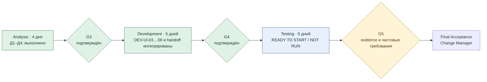

# M1-7: артефакты Change Manager

Единый файл изменения `ui-birth-form-and-facts`: описание, реестр решений, технический долг, задания ролям и дорожная карта. G3 завершён; реализация и Developer handoff интегрированы через PR #51. G4 подтверждён, change READY_FOR_TEST; `DEBT-CALC-001` остаётся OPEN / NON-BLOCKING для M1-7.

## Черновое описание изменения

**Статус изменения:** READY_FOR_TEST — реализация DEV-UI-01…08 и Developer handoff `ab072ec` интегрированы в `change/*` через PR #51 / `0c893f0`; G4 подтверждён. `DEBT-CALC-001` остаётся OPEN / NON-BLOCKING для M1-7: полный pytest имеет 2959 passed / 1 skipped, и skip не доказывает исключённое свойство. Tester execution, G5 и acceptance NOT RUN.
**Руководитель изменения:** агент Change Manager в `manager/ui-birth-form-and-facts-review-alignment`.
**Интеграционная ветка:** `change/ui-birth-form-and-facts`.
**История Intake:** `956a0d3acbb1536e57535c4689aee57efe607381` — исходный HEAD подготовки 2026-10-03.
**Текущий исходный commit `change/*`:** `0c893f0ce3f78787010f463662efe689c6ace242`; Developer handoff `ab072ec247e8d43d4f83e941263f77504dfeed55` интегрирован через PR #51. Implementation commit `f7fb34bce8de23d8c08a7491c5698a7b5ab9e4ab`; согласованный skip `DEBT-CALC-001` входит в handoff.
**Утверждённый Analysis-контракт:** `ce25dd0bebf5eb3b6d41fe933d1809005e5779ab`, 10 REQ / 23 AS, включён через PR #47. Повторно сверён Developer @ `082c6b9` и Tester @ `0f6aa82`; административный статус требований/сценариев обновляется этой Manager-редакцией, исторический нормативный вход сохраняется.
**Единый реестр:** [раздел «Единый реестр решений»](#decision-register); эта версия возвращается в `change/*` через отдельный Manager PR.
**Задания ролям:** [раздел «Задания ролям»](#role-tasks).
**Связанные строки:** `DP-UI-01`…`DP-UI-09`; долг страницы — `DEBT-UI-001` в [разделе технического долга](#technical-debt).
**Версия исходных материалов:** первичный просмотр — `956a0d3`, нормативный вход Analysis — `652bd734`; семантика Analyst — `ce25dd0`, plan/review — `082c6b9`, testability — `0f6aa82`, G3 — `e4f60fb` / merge `6fc62b9`. Текущий общий вход `0c893f0` содержит production UI, tests, Developer evidence и handoff PR #51. Эта Manager-редакция синхронизирует delivery status; runtime evidence не перезапускается и не переименовывается в Tester acceptance.

### Потребность и подтверждённые рамки

Пользователь хочет ввести дату, выбрать место из подсказок, указать время или явно отметить его неизвестным, построить карту и прочитать факты. HTTP API и production браузерный UI реализованы и интегрированы в `change/*`; независимая приёмка ещё не выполнена. На review 2026-10-05 владелец заменил прежний шестигрупповой scope на **три группы текущего `ChartDTO`: планеты/точки, дома, аспекты** (`DP-UI-01/02`). Поиск запускается с трёх символов (`DP-UI-06`); порядок формы — дата → место → время. UI получает уже рассчитанные факты и форматирует опубликованные градусы/минуты.

Целевой результат: в браузере человек вводит поддерживаемые данные, видит подсказки места и выбирает `place_id`, выполняет явное построение и читает факты своей карты. После обновления страницы тот же результат восстанавливается по session cookie и `GET /charts/current`, пока сессия жива. Значения таблиц происходят из реального результата API, а не из демонстрационных чисел макетов.

Показанная пользователем длинная дробь `degree_in_sign` относится к внутреннему расчётному объекту: текущий `PointDTO` уже не передаёт это поле, а публикует целые `degree`/`minute` и числовую `longitude`. UI показывает градусы и минуты без длинной дроби. Действующие `longitude`/`cusp_longitude` сохраняются; изменение DTO и округление внутреннего результата не входят в M1-7 (`DP-UI-02`).

Актуальный состав подтверждён в `DP-UI-01`, работа на текущем DTO — в `DP-UI-02`. История прежнего выбора шести групп сохранена в той же строке. Переименование `admin1_name` остаётся некритичным техническим долгом (`DP-UI-03`); статус и findings M1-6 этим change не меняются.

### Проверенные решения и материал текущего review

Проверены комментарии владельца в PR #43: [три группы](https://github.com/ksenia-baranova/exact-orb-demo/pull/43#discussion_r4179357890), [поиск с трёх букв](https://github.com/ksenia-baranova/exact-orb-demo/pull/43#discussion_r4179366994), [четыре дня Development](https://github.com/ksenia-baranova/exact-orb-demo/pull/43#discussion_r4179346983), [размещение будущих групп в макете](https://github.com/ksenia-baranova/exact-orb-demo/pull/43#discussion_r4179374962). Для gate учтён последний прямой ответ владельца в Analyst-thread: POST закрытого UI после ручной отметки; точное evidence находится в `DP-UI-04`.

Первичный просмотр `dbee888` охватывал 10 требований и 21 сценарий, HTTP DTO/routes/projectors, `application/session_view.py`, HTTP/session/place tests и ADR @ `652bd734`. Текущий просмотр `ce25dd0` охватывает 10 требований и **23 сценария**, диспозицию прежних findings, `FIND-UI-005` и оба document review. Замечания о кнопках и gate уже перенесены Analyst; ожидание промежуточной сводки снято. Подписанные рекомендации сохраняют автора и проверенную версию; Manager не меняет статусы findings внутри чужих документов.

### Дополнительно прочитано для этой редакции

| Материал | Проверенная версия | Результат для Manager |
|---|---|---|
| [Analysis](../../../requirements/changes/ui-birth-form-and-facts/analysis.md), [requirements](../../../requirements/changes/ui-birth-form-and-facts/requirements.md), [scenarios](../../../requirements/changes/ui-birth-form-and-facts/scenarios.md) | `ce25dd0`, интегрирован в `a6c4d6f` | диспозиции FIND-UI-001…005, REQ-UI-03/04/09, AS-UI-07/22/23 и выбор B для регистрации |
| [Developer document review](../../implementation_plans/ui_birth_form_and_facts_developer_review.md) | `b36b63d`, review baseline `9ae1abc`, PR #46 | reuse API реализуем; нужны повторная сверка исправленного пакета, estimate и Implementation Plan |
| [Implementation Plan](../../implementation_plans/ui_birth_form_and_facts_implementation_plan.md) и [повторная валидация Developer](../../implementation_plans/ui_birth_form_and_facts_developer_review.md#повторная-валидация-2026-10-06) | `082c6b9`, исходный `033217d` | FEASIBLE; 6 work items, зависимости, промты и estimate 5–8 дней со средней уверенностью; Developer findings закрыты на уровне контракта/baseline |
| [Tester document review](../../../testing/ui-birth-form-and-facts/tester.md) | первичный `81624f8` / `9ae1abc`; повторный `0f6aa82` / `082c6b9`, PR #49 | TESTABLE; 23 AS/stack сверены, три findings resolved in contract, estimate 3–5 подтверждён; runtime/browser acceptance отсутствует |
| `docs/requirements/http_api.md` §§9.2–9.3; `src/exact_orb/http_api/routes/build.py`; `tests/http_api/test_lifecycle.py` — два disconnect regression test | `a6c4d6f` | до commit возможна отмена, protected commit может завершиться после потери ответа; старый current не доказывает завершение задачи |
| `src/exact_orb/cli.py` `_format_orb`; REQ-UI-04 / AS-UI-07 | код @ `a6c4d6f`, Analyst @ `ce25dd0` | UI oracle округления отделён от чисел/category DTO и от правила точной половины в Python CLI |
| `src/exact_orb/http_api/app.py`; `tests/test_module_boundaries.py` HTTP/application boundaries; `tests/http_api/test_integration.py` | `082c6b9` | статически сверены существующая composition и публичные границы; plan не меняет business DTO/lifecycle и не доказывает ещё отсутствующий UI |
| Прямой ответ владельца в Analyst-thread `01a10396-b9f5-7be0-833c-9f6369047f8c`, turn `01a11206-9d36-78c3-9447-49e4a8597169` | прочитан 2026-10-06 | выбор «Вариант В» и предложение сообщения; evidence DP-UI-09 |

Чтение кода и существующих tests — статическая сверка; их выполнение и browser acceptance этой правкой не подтверждаются.

### Входные материалы первичного анализа

| Категория | Фактически прочитанный путь | Почему относится к M1-7 | Версия |
|---|---|---|---|
| Правила | `AGENTS.md` | границы роли, тестирования и архитектуры | `956a0d3` |
| Процесс | `docs/development_approach/skills/change-manager/SKILL.md`; `docs/development_approach/process.md`; `docs/development_approach/roles.md`; `docs/development_approach/development-approach.md` | ownership, gates и ролевой handoff | `956a0d3` |
| Шаблоны | `docs/development_approach/artifacts/change-manager.md`; `docs/development_approach/artifacts/decision-register.md` | формат brief и одного реестра | `956a0d3` |
| Требования | `docs/requirements/README.md`; `docs/requirements/current/README.md`; `docs/requirements/changes/README.md` | где лежит нормативный baseline и куда Analyst переносит change | `956a0d3` |
| Порядок работ | `docs/project_management/roadmap.md` §3.3, M1-6–M1-9 | scope M1-7, границы M1-8/M1-8.1/M1-9 | `956a0d3` |
| Статус смежного change | `docs/project_management/change_plans/http-api-and-session-middleware.md`; `docs/testing/http-api-and-session-middleware/tester.md`; `docs/requirements/overview.md` §2.1 | реализованный API, известный статус `PARTIAL` и `FIND-TEST-HTTP-002` | `956a0d3` |
| Публичный контракт | `docs/requirements/http_api.md` §§6–9, 13 | bootstrap/current, places, build, DTO, ошибки и recovery | `956a0d3` |
| UI, статус | `docs/ui_ux/README.md`; `docs/ui_ux/render_review.md`; `docs/ui_ux/decisions.md` | прототип — черновик; ошибки рендеров и открытые предложения | `956a0d3` |
| UI, поведение | `docs/ui_ux/requirements.md` §§4–6, 9–13 | форма, таблицы, состояния, клавиатура и mobile | `956a0d3` |
| Визуальный просмотр | `docs/ui_ux/renders/r1-input.png`; `r2-chart-ready.png`; `r5-chart-detail.png` | композиция формы, готовой карты и таблиц | `956a0d3` |
| Визуальный просмотр | `docs/ui_ux/mobile/e1-input.png`; `e2-place-suggestions.png`; `e3-chart-ready.png`; `e4-time-unknown.png`; `e5-chart-stale.png`; `e6-chart-unavailable.png`; `e7-chart-detail.png` | мобильная форма, поиск, готовность, неизвестное время, восстановление и таблицы | `956a0d3` |
| ADR | `docs/requirements/decisions/README.md`; `0008-cosmogram-and-hard-slots.md`; `0029-canonical-chart-point-identifiers.md`; `0030-lunar-node-axis-representative.md`; `0031-materialized-configuration-integrity.md`; `0032-unknown-birth-time-aspect-semantics.md`; `0033-unified-dignity-and-dispositor-system.md` | допустимые факты натала/космограммы и идентичность отношений | `956a0d3` |
| ADR | `docs/requirements/decisions/0034-birth-data-and-terms-of-use.md`; `0039-https-in-all-environments.md`; `0040-session-bootstrap-and-current-chart.md`; `0041-stored-chart-in-session.md` | условия формы, HTTPS/cookie, восстановление | `956a0d3` |
| Компоненты | `docs/requirements/component_responsibilities/exact-orb_place_catalog.md`; `exact-orb_build_natal_components.md`; `exact-orb_session_requirements.md` | выбор ID места, расчётный путь и состояние | `956a0d3` |
| Диаграммы | `docs/sequence_diagrams/http_api/README.md` и `001-session-bootstrap.puml`…`004-current-chart.puml`; `docs/sequence_diagrams/place_catalog/001-search-place-success.puml`; `docs/sequence_diagrams/session/002-session-restore-on-return.puml` | последовательности для сценариев и журнала | `956a0d3` |
| Код | `src/exact_orb/http_api/dto.py`; `projectors.py`; `routes/session.py`; `routes/places.py`; `routes/build.py`; `src/exact_orb/application/session_view.py` | фактическая форма HTTP DTO и вызовов | `956a0d3` |
| Код | `src/exact_orb/engine/ephemeris/calc.py`; `src/exact_orb/cli.py` | уже рассчитанные градусы и текущий human-readable CLI | `956a0d3` |
| Проверки | `tests/http_api/test_projectors.py`; `test_place_dto.py`; `test_session.py`; `test_integration.py`; `tests/test_edge_cases.py`; `tests/test_module_boundaries.py` | whitelist DTO, поиск, lifecycle и архитектурные инварианты | `956a0d3` |

`docs/requirements/current/` пока содержит только README; до переноса действуют зафиксированные прежние нормативные пути. Полный ролевой пакет с точными путями и приоритетом чтения находится в [заданиях](#role-tasks).

### Что показали макеты

- Р1 и Э1 задают тёмную палитру, форму и крупный основной CTA; Э2 показывает два одноимённых города с регионом и страной, ошибку невыбранного места и управление стрелками/Enter.
- Р5 и Э7 задают визуальный ритм секций и табличных строк; нарисованное колесо относится к M1-8, общий перенос экрана — к M1-8.1. Э3–Э6 показывают ожидаемые пользовательские состояния, но их данные и тексты требуют сверки с действующим DTO.
- Макеты содержат демо-значения, имя, CTA чата и варианты текста согласия. Они не являются test oracle. `render_review.md` фиксирует ошибки Р1/Р2. В Э4 показаны числовое смещение и диапазон Луны, которых действующий публичный контракт при неизвестном времени не обещает; их нельзя копировать как факты.
- Нормативные для поведения API/ADR имеют приоритет над демонстрационным `decisions.md`. В нём, например, предложен старый вид `ChartDTO` и `issues`, который расходится с реализованным контрактом.

### Findings Intake

| ID | Подтверждённое наблюдение | Влияние и следующий владелец |
|---|---|---|
| `FIND-UI-001` | Исторический разрыв между шестью группами и текущим DTO. Владелец сократил scope до трёх опубликованных групп. | Analyst @ `ce25dd0`: RESOLVED IN SCOPE по `DP-UI-01/02`; расширение DTO не требуется. UI evidence трёх групп остаётся задачей Tester. |
| `FIND-UI-002` | Требовалось разнести ручной checkbox gate закрытого UI и подготовку страницы/текста M1-9. Прежний вывод об обязательной странице перед каждым закрытым build был чрезмерным. На выбранном закрытом этапе страницы и её текста пока нет. | Analyst @ `ce25dd0`: RESOLVED FOR CLOSED STAGE по DP-UI-04/08; промежуточная сводка снята. DEBT-UI-001 остаётся OPEN; UI evidence gate ещё требуется. |
| `FIND-UI-003` | `ui_ux` — черновик; Р1 меняет порядок полей, Э1 содержит имя/согласие, Р2/Э3 содержат будущий чат/колесо; Э4 показывает значения вне действующего публичного контракта. | Analyst @ `ce25dd0`: RESOLVED IN REQUIREMENTS; DP-UI-05 перенесён в REQ-UI-03/10 и AS-UI-22. Макет и browser evidence ожидаются. |
| `FIND-UI-004` | Прежние требования не описывали шесть групп; теперь требуется макет трёх групп и продуманное место будущих секций. | Analyst @ `ce25dd0`: RESOLVED IN SCOPE по DP-UI-01/02; композиция REQ-UI-07 и browser evidence ожидаются. Будущие блоки не становятся текущими пустыми таблицами или новым API scope. |
| `FIND-UI-005` | После потери ответа POST старый/пустой current не доказывает завершение исходного build. Связан с FIND-DEV-UI-002 / TEST-FIND-UI-002. | DP-UI-09 зарегистрирован @ `64934fc`; REQ-UI-09 / AS-UI-23 @ `ce25dd0` сверены Developer `082c6b9` и Tester `0f6aa82`. Контрактный gap снят с accepted risk; UI evidence после реализации. |

### Предварительные границы

**Входит как подтверждённая цель:** форма даты/места/времени, autocomplete с порогом три символа и выбранным `place_id`, три группы текущего `ChartDTO`, сохранённая карта и явное построение через существующие endpoint. Макет адаптируется к трём группам с учётом будущего размещения секций. На закрытом стенде checkbox снят по умолчанию, POST разрешён после ручной отметки по принятому `DP-UI-04`.

**Не входит:** публикация и UI конфигураций, силы, особых градусов, оценки стихий; новые endpoint, публичные DTO-блоки и расчёт в браузере; SVG-колесо M1-8, полный перенос прототипа M1-8.1, реализация чата M2 и deployment M1-12/13. Отдельная страница условий зарегистрирована как долг M1-9 `DEBT-UI-001` и закрывается до распространения ссылки другим людям и публичного трафика. Переименование `admin1_name` отложено (`DP-UI-03`).

**Следующие результаты:** Tester выполняет независимые UI/browser/recovery проверки на `0c893f0`, включая retest TEST-FIND-UI-004…012; Analyst готовит чистовой перенос к G5. Расчётный Developer отдельно закрывает `DEBT-CALC-001`, снимает skip и получает полный pytest PASS — это условие полного G4. Budget 4/5/5 и диапазоны ролей сохраняются; DEBT-UI-001, DP-UI-03 и ограничения M1-6 действуют.

### Ожидаемый результат на приёмке — предварительный контур

Это ожидания Manager, не замена `requirements.md`/`scenarios.md` Analyst и evidence Tester.

1. В работающем браузере по HTTPS первый вход создаёт/восстанавливает cookie через bootstrap и получает фактическое состояние через current. Пустая сессия показывает форму; демо-данные не показываются как результат расчёта.
2. Поиск не отправляет GET при длине ввода меньше трёх символов; после порога и debounce показывает актуальные подсказки, одноимённые места различимы. Выбранный `place_id`, дата и `HH:MM` либо `birth_time:null` идут в build. Ошибки объясняются у поля, введённые значения сохраняются.
3. После явного успешного build экран готовности показывает две кнопки: «Открыть чат» — видимую, но неактивную в M1-7; «Показать подробности карты» — активную. Неактивная кнопка не открывает чат и не отправляет запросы при действиях мышью/клавиатурой. Подробности открывают таблицы **планет/точек, домов и аспектов** той же `chart_identity` из уже полученного DTO без повторного расчёта. Используются опубликованные ID, знак, целые градусы/минуты; `degree_in_sign` не выводится. Макет учитывает место будущих секций без их расчётных данных или заглушек.
4. При неизвестном времени строится космограмма: опубликованные точки и устойчивые аспекты показаны, отсутствие домов/углов объяснено. Техническое полуденное время, его offset и выдуманный диапазон Луны не показываются.
5. Обновление страницы с живой cookie даёт ту же `chart_identity` и те же факты из `GET /charts/current`. `chart_stale` сохраняет карту с пометкой и явным rebuild; `chart_unavailable` сохраняет birth input и предлагает явное построение. Неопределённый исход, 409 и лимиты обрабатываются по HTTP-контракту без автоматического повторения POST.
   Потеря ответа без HTTP outcome проверяется отдельно по REQ-UI-09 / AS-UI-23 и DP-UI-09; не подменять её полученным 503/504. Oracle текста орбиса — REQ-UI-04 / AS-UI-07: ближайшая минута, точная половина вверх, перенос `0.999°` → `1°00′`; числа и category DTO сохраняются.
6. Форма и таблицы доступны с клавиатуры и читаемы на узком экране; проверка опирается на реальные ответы/контрактные fixtures и сравнение с макетами только по композиции, палитре и ритму.
7. Tester фиксирует среду, baseline, сценарии, фактические результаты, ограничения и соответствие чистовой редакции требований. Final acceptance Manager возможна только после устранения или явного решения blocking `DP-*` и ролевого evidence.

Закрытый build после ручной отметки соответствует выбранному `DP-UI-04`; снятый checkbox запрещает POST. AS-UI-20 проверяет ручной gate, AS-UI-21 — закрытый этап и контроль долга страницы. Связанный `DEBT-UI-001` не блокирует этот закрытый этап, но до его закрытия ссылка другим людям не передаётся и публичный трафик не открывается. Browser evidence ещё не получено.

### Плановый бюджет и состояние

Актуальный плановый бюджет по `DP-UI-07`: **Analysis — 4 рабочих дня, Development — 5, Testing — 5; всего 14 рабочих дней**. Он задан владельцем в этой задаче и заменяет прежний target 1/4/2. Это бюджет фаз, не фактический табель, новый estimate роли или обещание календарной даты.

| Роль | Target | Полученная оценка и уверенность | Ограничения / действие |
|---|---|---|---|
| Analyst | 4 дня | исторический ориентир 1,5–2,5 дня собственной работы; средняя уверенность, Analysis @ `ce25dd0` | бюджет охватывает подготовку/возвраты/согласование; оставшийся чистовой перенос до G5 и ожидание решений учитывать отдельно, не выдавать 4 дня за измеренный факт |
| Developer | 5 дней | **5–8 дней / 40–64 часа**, средняя уверенность; Implementation Plan @ `082c6b9` | 5 дней — нижняя граница estimate; 6 work items с Developer checks и резервом 0,5 дня; подтверждение UI/browser ещё предстоит |
| Tester | 5 дней | **3–5 дней**, средняя-низкая уверенность, повторно подтверждено `tester.md` @ `0f6aa82` | бюджет соответствует верхней границе; 23 AS и native ES modules/Node seams сверены, runtime checks после реализации |

Tester включает fixtures/среду, автоматические UI checks, integration/browser HTTPS/cookie/recovery, клавиатуру/визуальные проверки и один retest. Допущения: reuse API/goldens, управляемые timer/network швы, стабильный HTTPS-стенд, контроль SQLite/restart. Исправления дефектов, дополнительные retest и ожидание решений вне диапазона. Developer предлагает HTML/CSS + native ES modules, Node tests без новых dependencies; Tester подтвердил testability этого stack и отдельные browser проверки в `0f6aa82`. FIND-TEST-HTTP-001 сохраняется.

Разница между новым Development бюджетом 5 и верхней границей estimate 8 — **до +3 рабочих дней**. Manager сохраняет диапазон и уверенность, не обещает выполнить его верхнюю границу за 5 дней. Если этот риск реализуется, до изменения срока/scope нужно пересогласование с владельцем; отдельный дополнительный бюджет не выделен. Утверждённая дата старта отсутствует.

## Change Plan: дорожная карта M1-7

**Статус плана:** READY_FOR_TEST — UI-реализация и воспроизводимый Developer handoff интегрированы в `0c893f0`; G4 подтверждён, независимое тестирование UI может начинаться. `DEBT-CALC-001` остаётся OPEN / NON-BLOCKING для M1-7. G5 и final acceptance не выполнялись.

Шкала Д1…Д14 — **относительный бюджет полного цикла M1-7**, а не фактический календарь. Analysis и Development поставлены; Developer handoff интегрирован 2026-10-08 и G4 подтверждён. Testing ещё не имеет независимого execution evidence. Открытый расчётный долг не блокирует M1-7 и ведётся отдельно.

| Фаза | Плановая шкала / бюджет | Контрольный результат | Условие перехода |
|---|---|---|---|
| Analysis и alignment | Д1–Д4 / 4 дня | Analyst `ce25dd0`, Developer plan/review `082c6b9`, независимый Tester `0f6aa82`; G2/alignment выполнены | G3 подтверждён Manager по этому пакету; фактические затраты не приравниваются к бюджету |
| Development | Д5–Д9 / 5 дней | DEV-UI-01…08, production UI, автоматические checks и handoff интегрированы PR #51 / `0c893f0` | Developer handoff принят; G4 подтверждён с согласованным неблокирующим исключением DEBT-CALC-001 |
| Testing | Д10–Д14 / 5 дней | независимая матрица REQ/AS → actual evidence, HTTP/UI/browser/keyboard/mobile, positive controls, retest, сверка чистовой редакции | независимый UI scope проверяется на `0c893f0`; G5 только после закрытия blocking defects и чистового переноса |
| Final Acceptance | после G5; отдельный бюджет не задан | delivered scope, открытый долг M1-9, карта переноса и точные role baselines | Manager принимает evidence; финальный PR/merge выполняются по отдельному поручению |

Фактический путь Developer: `DEV-UI-01…06 → DEV-UI-07/08 → handoff ab072ec → merge 0c893f0 → G4`. Дальше Tester выполняет независимую UI acceptance для G5. `DEBT-CALC-001` закрывается отдельным расчётным change и не блокирует M1-7. Чистовую редакцию/карту переноса готовит Analyst до G5, Tester сверяет её.

**Предел прогноза:** 14 дней — выбранный базовый бюджет. При Developer 8 и Testing 5 условный последовательный цикл с Analysis бюджетом 4 составит 17 рабочих дней; это риск/сценарий, не новый утверждённый бюджет. Ожидание review/PR, недоступность HTTPS-среды, новые зависимости и дополнительные исправления могут изменить календарь и требуют пересмотра.

### Проверка G2/G3 Manager

| Условие | Evidence / статус | Следующее действие |
|---|---|---|
| Analyst-контракт и выбранное поведение согласованы | MET: `ce25dd0`, 10 REQ / 23 AS, DP-UI-01…09; Developer/Tester сверили перенос | requirements/scenarios APPROVED FOR DEVELOPMENT; чистовой перенос до G5 |
| Developer feasibility, risks, estimate, plan | MET: `082c6b9`, FEASIBLE; реализация DEV-UI-01…08 и handoff @ `ab072ec` интегрированы в `0c893f0` | независимые UI-проверки; отдельно закрыть DEBT-CALC-001 |
| Независимая повторная сверка Tester | **MET**: `0f6aa82` на `082c6b9`, TESTABLE; TEST-FIND-UI-001…003 RESOLVED IN CONTRACT, estimate 3–5 подтверждён | независимая acceptance по implemented commit после G4; UI checks NOT RUN |
| Бюджет и зависимости | MET AS OWNER BUDGET: DP-UI-07 = 4/5/5, граф и риск +3 Development записаны | календарные даты после завершения gate; оценки ролей сохраняются |
| Blocking продуктовые DP | MET: DP-UI-01…09 ACCEPTED с owner evidence | нового выбора по scope/gate/кнопкам/recovery не требуется |
| Non-blocking items | DEBT-UI-001, DP-UI-03 и принятые ограничения M1-6 сохраняют owner/условие возврата | не закрывать чужую приёмку и не расширять scope |

**Решение Manager по G3 — 2026-10-07:** замечаний, блокирующих разработку, нет. G2/alignment завершены; требования/scenarios и Implementation Plan утверждены для исполнения, change/Change Plan получают READY_FOR_DEVELOPMENT. По прямому поручению владельца синхронизированы административные статусы связанных артефактов со ссылкой на этот источник. Авторские оценки и результаты review сохраняются; Tester TESTABLE не превращается в PASS реализации. После отдельно разрешённого commit/merge этой редакции передать Developer фактический общий HEAD `change/*`; только он служит воспроизводимым input для исполнения. IN_DEVELOPMENT фиксируется при фактическом старте работ, не сейчас.

### Проверка G4 Manager

| Условие G4 | Evidence / статус | Действие |
|---|---|---|
| Implementation соответствует baseline requirements | **MET FOR TEST:** DEV-UI-01…08 реализованы на семантике `ce25dd0`; implementation `f7fb34b`, handoff `ab072ec`, merge PR #51 / `0c893f0` | Tester сверяет 10 REQ / 23 AS на точном merge commit |
| Developer checks выполнены | **MET WITH ACCEPTED EXCEPTION:** 180 Node passed, 300 HTTP passed, полный pytest 2959 passed / 1 skipped; точечный skip разрешён владельцем и помечен DEBT-CALC-001 | расчётный Developer закрывает долг отдельно; исключённое свойство не считается доказанным |
| Diff, ограничения и reproducible handoff описаны | **MET:** раздел 25 Implementation Plan содержит версии, команды, порядок запуска и NOT RUN; handoff находится в `change/*` | Tester фиксирует собственную среду и actual results |
| Blocking development findings закрыты | **MET FOR G4:** TEST-FIND-UI-004…012 имеют исправления и остаются FIXED PENDING RETEST для независимого Testing; `DEBT-CALC-001` OPEN / NON-BLOCKING для M1-7 | retest findings обязателен до G5; расчётный долг закрывается отдельно |
| Контрактная документация синхронизирована | **MET FOR TEST:** требования не менялись, manual bug registry и Developer handoff интегрированы | Analyst готовит clean transfer до G5 |

**Решение Manager по G4 — 2026-10-08:** G4 подтверждён, change получает `READY_FOR_TEST`. UI implementation handoff принят как воспроизводимый вход Tester для независимых UI/browser/recovery проверок на `0c893f0`. `DEBT-CALC-001` остаётся OPEN / NON-BLOCKING для M1-7; согласованный skip не доказывает исключённое свойство. G5 и acceptance остаются NOT RUN.

### Интеграция и контрольные результаты

| Результат | Role commit / PR | Merge в `change/*` | Что подтверждено |
|---|---|---|---|
| Первичный Manager пакет | `6aca99d`, PR #42 | `652bd734` | Intake и исходный реестр |
| Manager: принятые scope/gate/кнопки | `ad8892f`, [PR #44](https://github.com/ksenia-baranova/exact-orb-demo/pull/44) | `ea0678d` | DP-UI-01…08 и долг; интеграция документации |
| Первичный Analyst review | `dbee888`, [PR #43](https://github.com/ksenia-baranova/exact-orb-demo/pull/43) | `9ae1abc` | 10 REQ и 21 AS; исторический review baseline |
| Tester document review | `81624f8`, [PR #45](https://github.com/ksenia-baranova/exact-orb-demo/pull/45) | `91537c6` | testability findings и estimate; не browser acceptance |
| Developer document review | `b36b63d`, [PR #46](https://github.com/ksenia-baranova/exact-orb-demo/pull/46) | `4a5f128` | feasibility и findings; estimate/Implementation Plan не подготовлены |
| Analyst после возврата ролей | `ce25dd0`, [PR #47](https://github.com/ksenia-baranova/exact-orb-demo/pull/47) | `a6c4d6f` | 10 REQ, 23 AS, перенос DP-UI-05/08, oracle орбиса, выбранный recovery B |
| Manager: регистрация recovery и ролевых результатов | `64934fc`, [PR #48](https://github.com/ksenia-baranova/exact-orb-demo/pull/48) | `033217d` | DP-UI-09, baselines и диспозиция возврата |
| Developer: Implementation Plan и повторное review | `082c6b9` | включён в текущий `2972e42` | FEASIBLE, 6 work items, estimate 5–8; findings resolved in contract, реализация NOT STARTED |
| Tester: независимая повторная сверка | `0f6aa82`, [PR #49](https://github.com/ksenia-baranova/exact-orb-demo/pull/49) | `2972e42` | TESTABLE на 23 AS/stack; 3 findings resolved in contract, estimate 3–5 подтверждён |
| Manager: G3 и budgets 4/5/5 | `e4f60fb`, [PR #50](https://github.com/ksenia-baranova/exact-orb-demo/pull/50) | `6fc62b9` | READY_FOR_DEVELOPMENT, утверждённые REQ/AS и roadmap |
| Developer: UI implementation и handoff | `f7fb34b`, `ab072ec`, [PR #51](https://github.com/ksenia-baranova/exact-orb-demo/pull/51) | `0c893f0` | DEV-UI-01…08, READY_FOR_TEST у Developer; 180 Node, 300 HTTP, 2959 passed / 1 skipped; acceptance NOT RUN |

Manager-ветка fast-forward до `0c893f0`. Эта административная редакция фиксирует READY_FOR_TEST и подтверждённый G4 отдельным Manager commit; до её merge общий baseline `change/*` остаётся `0c893f0`. Merge PR #51 доказывает интеграцию implementation/handoff, но не независимую Tester acceptance или G5.

### Диспозиция замечаний и завершение G2

| Замечания / тип | Диспозиция Analyst @ `ce25dd0` | Следующий контроль и владелец |
|---|---|---|
| FIND-DEV-UI-001 / TEST-FIND-UI-001 — requirement gap | DP-UI-05 перенесён в REQ-UI-03/10 и AS-UI-22 | Developer `082c6b9` и Tester `0f6aa82` подтвердили контракт; оба finding resolved in contract; UI evidence после реализации |
| FIND-DEV-UI-002 / TEST-FIND-UI-002 / FIND-UI-005 — recovery semantics | REQ-UI-09 / AS-UI-23 и зарегистрированный DP-UI-09 | Developer/Tester подтвердили контракт и accepted risk; DEV-UI-05 оценён в 1–1,5 дня; runtime evidence после реализации |
| FIND-DEV-UI-003 — baseline / delivery documentation | Manager PR #48 интегрирован, актуальный общий вход `2972e42` | Developer resolved for consultation baseline; административные ссылки/статусы актуализированы этой Manager-редакцией |
| TEST-FIND-UI-003 — formatting oracle | REQ-UI-04 / AS-UI-07, Math.round для неотрицательного orb | Tester `0f6aa82`: RESOLVED IN CONTRACT; Developer spike 7 cases — его evidence; UI renderer checks после реализации |

Исходный document review обеих ролей относится к `9ae1abc`. G3-пакет подтверждён и implementation/handoff интегрированы в `0c893f0`. UI findings TEST-FIND-UI-004…012 исправлены Developer и ожидают retest; независимая acceptance по-прежнему отсутствует.

[Дорожная карта](#roadmap), budgets 4/5/5 и estimates 5–8 / 3–5 сохраняются как плановые основания. Development handoff интегрирован, G4 подтверждён, change READY_FOR_TEST; Tester может проверять независимый UI scope. DEBT-CALC-001 закрывается отдельно и не блокирует M1-7.

## Единый реестр решений

**Владелец структуры и baseline:** Change Manager.
**Интеграционная ветка:** `change/ui-birth-form-and-facts`.
**Исходный commit текущего alignment:** `2972e4248237fed4913b96c4c5e6b4c1d9105fe9`; нормативный вход Analysis `652bd734` сохранён как исторический.
**Baseline этой редакции:** рабочая Manager-версия поверх `2972e42`; точный SHA административного утверждения передаётся после отдельно порученного commit. Семантика Analyst `ce25dd0`, Developer plan/вклад `082c6b9`, независимый Tester `0f6aa82`. DP-UI-07 содержит прямой budget 4/5/5; остальные выборы сохраняются.
**Текущий статус change:** [в описании изменения](#change-brief); G2/alignment и G3 подтверждены этой редакцией после поступления всех ролевых результатов.

Вопрос, варианты, рекомендации и выбор хранятся в одной строке. Ролевые документы ссылаются только на ID и baseline. `ACCEPTED` ниже подтверждены прямыми ответами владельца в задаче и PR review; отсутствие консультации не выдаётся за согласие ролей.

| ID | Статус и gate | Вопрос, контекст и различающий пример | Связанные источники | Владелец и консультанты | Варианты и влияние | Рекомендации ролей | Решение владельца и основание | Последствия, обновления и evidence |
|---|---|---|---|---|---|---|---|---|
| `DP-UI-01` | **ACCEPTED**; актуальный scope M1-7. | **Вопрос:** какие группы поставляет M1-7? **Контекст:** 2026-10-03 принят полный набор; review 2026-10-05 сокращает его. **Пример:** текущий DTO содержит точки, дома, аспекты; дополнительные группы требуют другой публичной проекции. | `FIND-UI-001/004`; roadmap M1-7; HTTP §7.2 @ `652bd734`; owner review PR #43. | **Владелец:** пользователь. **Консультанты:** Analyst, Developer, Tester. | **A:** три группы текущего DTO. **B:** прежние шесть групп с расширением публичного контракта. | **Analyst (2026-10-05 @ `dbee888`):** три группы реализуются на текущем DTO; будущие секции учитываются в макете. **Developer (2026-10-06 @ `b36b63d`; document review):** три группы реализуемы на текущем API; UI ещё не поставлен. **Tester (2026-10-06 @ `81624f8`; review baseline `9ae1abc`):** три группы имеют прослеживаемые REQ/AS; реализованный browser путь ещё не проверен. **Developer (повторная сверка 2026-10-06; baseline `033217d`, текущий рабочий пакет):** Перенос в REQ-UI-04…07 / AS-UI-07…09/19 сверён; контракт трёх групп реализуем. См. [повторная валидация Developer](../../implementation_plans/ui_birth_form_and_facts_developer_review.md#повторная-валидация-2026-10-06). UI evidence ещё не получено. **Tester (повторная сверка @ `0f6aa82`, baseline `082c6b9`):** три группы и все 10 REQ / 23 AS имеют наблюдаемые checks; TESTABLE, UI NOT RUN. | **Выбрано:** A, заменяет прежний выбор B от 2026-10-03. **Правило:** планеты/точки, дома, аспекты; конфигурации, сила, особые градусы и оценка стихий сняты с M1-7. **Основание:** ранний минимальный рабочий сценарий без нового endpoint/публичных блоков. | **Дата:** 2026-10-05. **Evidence:** [решение о трёх группах](https://github.com/ksenia-baranova/exact-orb-demo/pull/43#discussion_r4179357890), [размещение будущих секций](https://github.com/ksenia-baranova/exact-orb-demo/pull/43#discussion_r4179374962). Обновить roadmap, acceptance и задания. Возврат дополнительных групп требует отдельного scope; этот выбор не отменяет их расчёт в движке. |
| `DP-UI-02` | **ACCEPTED**; дельта DTO снята с M1-7, не блокирует G2. | **Вопрос:** требуется ли новый публичный контракт для актуального scope? **История:** прежний вопрос касался структуры конфигураций/силы/особых градусов; после `DP-UI-01` они не входят в M1-7. **Пример:** POST и current уже публикуют нужные три группы. | `FIND-UI-001`; HTTP §7.2, `dto.py`, `projectors.py`, `test_projectors.py` @ `652bd734`; `DP-UI-01`. | **Владелец:** пользователь как владелец публичного объёма. **Консультанты:** Analyst, Developer, Tester. | **A:** расширить whitelist для прежних групп. **B:** отдельная операция фактов. **C:** текущий DTO и существующие POST/current для трёх групп. | **Functional Analyst (2026-10-05 @ `dbee888`):** после сокращения scope не добавлять endpoint/поля для конфигураций, силы, особых градусов; применить существующий `ChartDTO` с одинаковой семантикой committed POST/restored GET. Возврат остальных групп — отдельный scope и контракт. **Developer (2026-10-06; document review @ `9ae1abc`):** Повторное использование текущих DTO и общего project_chart технически реализуемо по прочитанным dto.py/projectors.py и существующим test_projectors.py/test_session.py. Новые публичные блоки не нужны; UI formatting и browser POST/current parity ещё требуют реализации и проверок. См. [Developer review](../../implementation_plans/ui_birth_form_and_facts_developer_review.md#комментарии-к-существующим-требованиям). **Tester (2026-10-06 @ `81624f8`; review baseline `9ae1abc`):** нужны UI assertions для опубликованных фактов, null/пустых списков, POST/current parity и whitelist; серверные tests не заменяют UI evidence.  **Functional Analyst (2026-10-06 @ `ce25dd0`):** FIND-UI-001 отмечен RESOLVED IN SCOPE; REQ-UI-04…06 остаются на текущем ChartDTO. **Developer (повторная сверка 2026-10-06; baseline `033217d`, текущий рабочий пакет):** Повторная сверка текущих DTO/projectors и контрактов успешна; target projector suite 27 passed, related HTTP/boundary suite 339 passed (не число уникальных тестов в сумме). [Implementation Plan](../../implementation_plans/ui_birth_form_and_facts_implementation_plan.md) предусматривает native HTML/CSS/ES modules, same-origin доставку assets в существующем приложении и package-data, без нового API/dependencies. Это выбранный технический способ внутри scope; browser evidence позже. **Tester (повторная сверка @ `0f6aa82`, baseline `082c6b9`):** POST/current, whitelist и public facts покрыты planned evidence; TESTABLE, новые DTO-блоки не нужны. | **Выбрано:** C. **Правило:** сохранить публичный DTO, whitelist, текущие endpoint и вычислительное поведение; браузер форматирует уже опубликованные факты. **Основание:** решение владельца снять дополнительные группы и не вводить endpoint. | **Дата:** 2026-10-05. **Evidence:** [owner review](https://github.com/ksenia-baranova/exact-orb-demo/pull/43#discussion_r4179357890). DTO-дельта `REQ-API-UI-01…03` снята Analyst @ `dbee888`. Developer проверяет reuse и POST/current parity, Tester — UI и восстановление на этом контракте. Действующие долготы сохраняются; внутренний artifact не становится HTTP payload. |
| `DP-UI-03` | **ACCEPTED**; не блокирует M1-7. | **Вопрос:** переименовывать ли публичное техническое поле `admin1_name` в этой работе? **Пример:** два Кировска различаются регионом и страной, но API использует имя поля GeoNames. | `FIND-TEST-HTTP-002` в `docs/testing/http-api-and-session-middleware/tester.md`; `http_api.md` §6.3; `ui_ux/requirements.md` §4; `dto.py` @ `956a0d3`. | **Владелец:** пользователь. **Консультанты для будущего change:** Analyst, Developer, Tester. | **A:** переименовать сейчас — затронуть API, тесты и клиентов, расширив M1-7. **B:** оставить текущий ключ, выводить человеку регион/страну и перенести переименование в отдельный технический долг. | **Analyst/Developer/Tester:** для M1-7 не запрошены; это не рекомендация от их имени. **Developer (повторная сверка 2026-10-06; baseline `033217d`, текущий рабочий пакет):** REQ-UI-02 и AS-UI-02/18 соответствуют действующему PlaceSuggestionDTO; UI использует текущий ключ, migration/alias не планируются. См. [повторная валидация Developer](../../implementation_plans/ui_birth_form_and_facts_developer_review.md#повторная-валидация-2026-10-06). Прежний долг и PARTIAL M1-6 сохраняются. | **Выбрано:** B. **Правило:** `admin1_name` остаётся публичным ключом M1-7; переименование не критично для этого change и выполняется отдельной задачей технического долга без пока выбранного нового имени. **Основание:** сообщения пользователя «оставь как есть», «переименование возьмем в тех долг» и поручение добавить решение, 2026-10-03. | **Последствия:** UI использует действующий ключ, но подписывает значение человеческим словом «регион»; новая строка/alias в DTO сейчас не вводится. **Возврат к долгу:** отдельная постановка изменения API naming с оценкой миграции. **Evidence:** сообщения пользователя в этой задаче. **Ограничение:** это решение не закрывает прочие findings, статус `PARTIAL` или final acceptance M1-6. |
| `DP-UI-04` | **ACCEPTED**; закрытый checkbox gate согласован, долг страницы блокирует распространение ссылки/публичный трафик. | **Вопрос:** как поэтапно поставить checkbox и отдельную страницу? **Пример:** на закрытом стенде POST возможен после ручной отметки при ещё неготовой странице. Прежнее толкование о странице до каждого build и обязательной ревизии ADR исправлено. | `FIND-UI-002`; ADR-0034 §§2–3 @ `652bd734`; AS-UI-20/21 и correction Analysis @ `dbee888`; прямые ответы владельца. | **Владелец:** пользователь. **Консультанты:** Analyst, Developer, Tester. Technical Reviewer не обязателен: архитектурное решение не меняется. | **A:** отдельная страница раньше M1-9. **B:** выбранный закрытый этап с ручным gate; страница как долг M1-9 до распространения ссылки и публичного трафика. | **Functional Analyst (2026-10-05 @ `dbee888`):** сохранить ADR-0034; checkbox снят по умолчанию и вручную отмечается до POST; отдельную страницу с содержанием §2 оформить как долг M1-9 и закрыть до распространения ссылки/публичного трафика. Tester проверяет оба этапа. **Developer (2026-10-06; document review @ `9ae1abc`):** Ручной presentation gate реализуется в форме без поля в POST и без persistence. Технических оснований включать отдельную страницу в закрытый M1-7 нет; границы долга и публичного доступа сохраняются. Сверку Analyst с актуальным реестром вернуть по [FIND-DEV-UI-003](../../implementation_plans/ui_birth_form_and_facts_developer_review.md#find-dev-ui-003-несинхронизированные-текущие-статусы-и-handoff). Browser evidence не получено. **Tester (2026-10-06 @ `81624f8`; review baseline `9ae1abc`):** AS-UI-20/21 проверяются на реальном UI: default снят, ручной gate, отсутствие persistence; evidence ещё нет.  **Functional Analyst (2026-10-06 @ `ce25dd0`):** FIND-UI-002 отмечен RESOLVED FOR CLOSED STAGE; текст/страница остаются DEBT-UI-001. **Developer (повторная сверка 2026-10-06; baseline `033217d`, текущий рабочий пакет):** REQ-UI-03 и AS-UI-20/21 сверены с ADR/реестром; контракт закрытого gate согласован, DEBT-UI-001 остаётся открытым. См. [повторная валидация Developer](../../implementation_plans/ui_birth_form_and_facts_developer_review.md#повторная-валидация-2026-10-06). Готовность UI и публичного доступа не заявлена. **Tester (повторная сверка @ `0f6aa82`, baseline `082c6b9`):** ручной closed-stage gate и долг страницы разведены, AS-UI-20/21 сверены; runtime evidence после реализации. | **Выбрано:** B. **Правило:** закрытый UI допускает POST после ручной отметки исходно снятого checkbox; отдельная страница поставляется позже как DEBT-UI-001. ADR-0034 не меняется. **Основание:** владелец подтвердил ручной gate и отдельно поручил внести страницу в технический долг. | **Дата:** 2026-10-05. **Evidence:** [граница распространения ссылки](https://github.com/ksenia-baranova/exact-orb-demo/pull/43#discussion_r4179370676); прямой ответ «Да, после ручной отметки» в Analyst-thread `01a10396-b9f5-7be0-833c-9f6369047f8c`, turn `01a108cd-d8a8-78b0-93fa-f30ef1baf3cc`; последнее уточнение «Не меняем ADR но страницу внесем в тех долг», turn `01a10d96-420f-7730-abe5-80ca4c718a65`, проверено 2026-10-05. **Последствия:** долг зарегистрирован [ниже](#technical-debt); текущий этап без готовых страницы/текста уточнён в DP-UI-08. Отметка не отправляется в доменную команду, не хранится и не доказывает юридическое согласие. |
| `DP-UI-05` | **ACCEPTED**; состав формы и состояния двух действий согласованы, не блокирует G2. | **Вопрос:** какие поля формы и действия после расчёта входят в M1-7? **Пример:** имени нет; после расчёта кнопка чата видна, но неактивна, а подробности текущей карты доступны. | `FIND-UI-003`; UI/UX draft; HTTP §6.4 @ `652bd734`; Analysis @ `dbee888`; прямые diff-comments владельца к `artifacts.md:121` и `artifacts.md:82`. | **Владелец:** пользователь. **Консультанты:** Analyst, Developer, Tester; UI/UX для макета. | **A:** прежняя рекомендация — поля build и подробности без чата. **B:** имя только на клиенте. **C:** выбранный состав — без имени; после расчёта видимая неактивная кнопка «Открыть чат» и активная «Показать подробности карты». | **Functional Analyst (2026-10-05 @ `dbee888`, до нового выбора):** оставить дату, место, время и кнопки «Построить карту»/recovery; имя и кнопку чата не показывать без нового решения. CTA — кнопка действия, не соглашение. **Developer (2026-10-06; document review @ `9ae1abc`):** Выбранный observable flow реализуем на существующем ChartDTO, но ещё не перенесён в requirements/scenarios. До реализации экрана готовности нужен обновлённый Analyst-пакет и позитивный контроль перехода к подробностям; новый выбор владельца не требуется. См. [FIND-DEV-UI-001](../../implementation_plans/ui_birth_form_and_facts_developer_review.md#find-dev-ui-001-нет-требований-и-сценариев-по-принятому-dp-ui-05). **Tester (2026-10-06 @ `81624f8`; review baseline `9ae1abc`):** TEST-FIND-UI-001 требует переноса принятого состава в REQ/AS и повторной сверки; browser retest позже.  **Functional Analyst (2026-10-06 @ `ce25dd0`):** перенос выполнен в REQ-UI-03/10 и AS-UI-22: неактивный чат и активные подробности той же chart_identity; FIND-UI-003 — RESOLVED IN REQUIREMENTS. Developer/Tester повторно сверяют эту редакцию; их review исходного baseline не считается новым approval. **Developer (повторная сверка 2026-10-06; baseline `033217d`, текущий рабочий пакет):** REQ-UI-03/10 и AS-UI-22 теперь содержат observable flow и позитивный контроль details; FIND-DEV-UI-001 закрыт на уровне контракта. Реализация/проверки действий — DEV-UI-04 в [Implementation Plan](../../implementation_plans/ui_birth_form_and_facts_implementation_plan.md); дополнительный выбор владельца не нужен. **Tester (повторная сверка @ `0f6aa82`, baseline `082c6b9`):** REQ-UI-03/10 и AS-UI-22 сверены; TEST-FIND-UI-001 RESOLVED IN CONTRACT, активные подробности и disabled chat наблюдаемы. | **Выбрано:** C. **Правило:** имя не вводится и не хранится. После расчёта «Открыть чат» показана, но неактивна в M1-7; активация относится к поставке чата M2. «Показать подробности карты» активна и открывает опубликованные планеты/точки, дома и аспекты текущей карты без повторного POST. Кнопка построения остаётся отдельным действием. | **История evidence:** выбор формы/двух действий 2026-10-05 в diff-comment к `artifacts.md:121`: «Имя не нужно», после расчёта чат и подробности. Последнее уточнение владельца к правой стороне `artifacts.md:82`: «Кнопка доступна но не активна». Analyst обновляет требования/сценарии; UI/UX — экран готовности/подробностей; Developer/Tester — состояния кнопок, отсутствие эффекта неактивного чата и активную навигацию к фактам. Реализация чата остаётся M2; текущий DTO не расширяется. |
| `DP-UI-06` | **ACCEPTED**; порог browser поиска. | **Вопрос:** с какой длины ввода отправлять поиск места? **Пример:** `К`/`Ки` ещё не запускают GET; `Кир` запускает поиск после debounce. | REQ-UI-02, AS-UI-02 @ `dbee888`; HTTP `/places` и catalog @ `652bd734`. | **Владелец:** пользователь. **Консультанты:** Analyst, Developer, Tester. | **A:** с одной буквы. **B:** с двух. **C:** с трёх; более поздняя выдача и меньше запросов коротких префиксов. | **Analyst (2026-10-05 @ `dbee888`):** требования и сценарии обновлены на три символа; debounce и устаревшие ответы описаны. **Developer (2026-10-06 @ `b36b63d`; document review):** UI-порог, сброс ID и подавление поздних ответов реализуемы без изменения catalog/API. **Tester (2026-10-06 @ `81624f8`; review baseline `9ae1abc`):** планировать 2→3→4→2, поздний ответ после очистки, отдельный place_id, keyboard/mouse; выполнение UI checks ещё впереди. **Developer (повторная сверка 2026-10-06; baseline `033217d`, текущий рабочий пакет):** REQ-UI-02 / AS-UI-02 сверены; управляемый timer/network и generation предусмотрены DEV-UI-02 в [Implementation Plan](../../implementation_plans/ui_birth_form_and_facts_implementation_plan.md). Existing server tests проходят; client late-response/keyboard evidence ещё предстоит. **Tester (повторная сверка @ `0f6aa82`, baseline `082c6b9`):** порог/late response/selection представлены в независимых сценариях; execution evidence ещё NOT RUN. | **Выбрано:** C. **Правило:** GET начиная с трёх символов; ниже порога и для пустого ввода запросов нет. Новый допустимый префикс получает актуальную выдачу после debounce. **Основание:** прямой выбор владельца. | **Дата:** 2026-10-05. **Evidence:** [«с 3 первых букв»](https://github.com/ksenia-baranova/exact-orb-demo/pull/43#discussion_r4179366994). Это UI-порог, ограничения API/нормализация/ранжирование каталога не меняются; Tester проверяет 2→3→4→2, поздние ответы и сброс выбранного ID. |
| `DP-UI-07` | **ACCEPTED**; плановый бюджет 4/5/5, не измеренный факт или обещание даты. | **Вопрос:** какой бюджет фаз использовать после получения Implementation Plan? **История:** 1/2/2 → 1/4/2; новый прямой запрос владельца — Analysis 4, Development 5, Testing 5. **Пример:** Developer estimate 5–8 сохраняется при бюджете 5; Tester estimate 3–5 помещается в бюджет 5. | Первичные запросы/PR #43; Analysis @ `ce25dd0`; Tester @ `81624f8`; Developer Implementation Plan @ `082c6b9`; текущий прямой запрос владельца в Manager-task. | **Владелец target:** пользователь. **Владельцы estimates:** Analyst, Developer, Tester; Manager сводит зависимости и календарь. | **A:** исторический 1/2/2. **B:** прежний 1/4/2, выбранный 2026-10-05. **C:** новый бюджет 4/5/5; базовая сумма фаз 14 рабочих дней, зависимость от G3/G4 и риск Developer +3 дня остаются явными. | **Analyst (2026-10-05 @ `dbee888`):** 1 день относится к первичному G1 draft; review, смена scope, оформление долга и чистовой перенос требуют отдельного времени. Ориентир собственной работы 1,5–2,5 дня со средней уверенностью. **Developer (2026-10-06 @ `b36b63d`):** estimate и полный Implementation Plan не подготовлены; target 4 дня не подтверждён ролью. **Tester (2026-10-06 @ `81624f8`; review baseline `9ae1abc`):** estimate 3–5 рабочих дней собственной работы, средняя-низкая уверенность; после согласования требований и готовой реализации, допущения — в [разделе бюджета](#budget-status). Требуется сверка после `ce25dd0`; Testing target 2 дня не является подтверждённой длительностью.  **Functional Analyst (2026-10-06 @ `ce25dd0`):** сверить расхождение target и estimate Tester; получить Developer estimate, затем согласовать календарь. **Developer (повторная сверка 2026-10-06; baseline `033217d`, текущий рабочий пакет):** Estimate подготовлен: 5–8 рабочих дней / 40–64 часа, уверенность средняя, 8 часов в дне; basis, assumptions, excluded work и резерв 0,5 дня — в [Implementation Plan](../../implementation_plans/ui_birth_form_and_facts_implementation_plan.md). От target Development отклонение +1…4 дня. Собственный estimate не включает Tester/Analyst или календарное ожидание; Manager согласует delivery/Gantt. Старый вывод b36b63d сохранён как история. **Change Manager (после запроса владельца 2026-10-06):** новый budget Development 5 покрывает нижнюю границу 5–8, Testing 5 — верхнюю границу 3–5. Исторические отклонения +1…4 / +1…3 в ролевых документах относятся к старому target 1/4/2. Текущий риск Development — до +3 дней; estimates/уверенность ролей не переписаны. **Tester (повторная сверка @ `0f6aa82`, baseline `082c6b9`):** estimate 3–5 рабочих дней со средней-низкой уверенностью подтверждён при stated environment; новый budget 5 не изменяет эту оценку. | **Выбрано:** C, заменяет выбор B. **Правило:** плановые бюджеты Analysis 4, Development 5, Testing 5 рабочих дней. Базовый цикл фаз — 14 рабочих дней на относительной шкале; дата старта не задана. Это не фактические затраты и не новое обещание Developer. **Основание:** прямой текущий запрос владельца. | **Дата:** 2026-10-06. **Evidence:** сообщение владельца в этой Manager-task: «Analysis — 4 дня; Development — 5 дней; Testing — 5 дней». История target Development 4 сохранена в [review PR #43](https://github.com/ksenia-baranova/exact-orb-demo/pull/43#discussion_r4179346983). Новая [дорожная карта](#roadmap) фиксирует очередность, gates и риск. Дополнительные +3 дня не утверждены автоматически; при реализации риска срок/scope возвращаются владельцу. Независимая повторная сверка Tester нужна до G3; изменение бюджета само по себе gate не закрывает. |
| `DP-UI-08` | **ACCEPTED**; отсутствие страницы и её текста не блокирует выбранный закрытый этап. | **Вопрос:** требуется ли подготовить текст условий до ручного checkbox gate закрытого UI? **Пример:** пользователь ставит отметку вручную; отдельная страница и её текст ещё не подготовлены. | DP-UI-04, DEBT-UI-001; ADR-0034 §2; предложение Analysis @ `dbee888`; прямой diff-comment владельца к этой строке 2026-10-05. | **Владелец:** пользователь. **Консультанты:** Analyst, Developer, Tester. | **A:** предварительная сводка условий в форме, предложенная Analyst. **B:** выбранный закрытый этап с ручной отметкой без готовых страницы и её текста; подготовка текста вместе со страницей в M1-9. | **Functional Analyst (2026-10-05 @ `dbee888`, до уточнения владельца):** предложил краткую сводку условий в форме до отдельной страницы; она не подменяет долг страницы. **Developer (2026-10-06; document review @ `9ae1abc`):** Принятый закрытый этап технически реализуем без промежуточной сводки. Предложение Analysis до этого выбора следует отметить как снятое и синхронизировать handoff по [FIND-DEV-UI-003](../../implementation_plans/ui_birth_form_and_facts_developer_review.md#find-dev-ui-003-несинхронизированные-текущие-статусы-и-handoff). DEBT-UI-001 остаётся открытым; это документный review, не приёмка UI. **Tester (2026-10-06 @ `81624f8`; review baseline `9ae1abc`):** планировать ручной gate закрытого этапа и отдельно контроль долга до распространения ссылки; evidence UI отсутствует.  **Functional Analyst (2026-10-06 @ `ce25dd0`):** прежнее предложение сводки снято; REQ-UI-03 и AS-UI-20/21 синхронизированы с выбранным закрытым этапом. **Developer (повторная сверка 2026-10-06; baseline `033217d`, текущий рабочий пакет):** Снятие промежуточного предложения в Analyst @ ce25dd0 подтверждено; REQ-UI-03 / AS-UI-20/21 сверены. См. [повторная валидация Developer](../../implementation_plans/ui_birth_form_and_facts_developer_review.md#повторная-валидация-2026-10-06). Отложенный текст/страница не включены в Developer estimate закрытого этапа. **Tester (повторная сверка @ `0f6aa82`, baseline `082c6b9`):** gate без intermediate copy и контроль DEBT-UI-001 сверены; отдельная страница не prerequisite closed-stage build. | **Выбрано:** B. **Правило:** пользователь вручную отмечает исходно снятый checkbox и может отправить POST закрытого UI, хотя страницы и её текста пока нет. Предварительная сводка не является обязательной работой или условием приёмки этого этапа. Полный текст и страницу готовят вместе по DEBT-UI-001. | **Дата:** 2026-10-05. **Evidence:** прямой комментарий владельца к правой стороне `artifacts.md:124`: «Пользователь ставит руками но текста страницы и страницы пока нет». Analyst обновляет требования/сценарии и снимает ожидание промежуточной копии; Developer/Tester проверяют ручной gate этого закрытого этапа. Условие закрытия долга до распространения ссылки/публичного трафика сохраняется. |
| `DP-UI-09` | **ACCEPTED**; независимый contract review подтверждён, UI evidence после реализации. | **Вопрос:** когда разрешить новый build, если ответ POST потерян, а current старый/пустой? **Пример:** первый protected commit ещё может завершиться после успешного GET; сетевой обрыв не доказывает отмену. | FIND-UI-005; FIND-DEV-UI-002; TEST-FIND-UI-002; HTTP §§9.2–9.3, `routes/build.py` и disconnect tests @ `a6c4d6f`; REQ-UI-09 / AS-UI-23 @ `ce25dd0`. | **Владелец:** пользователь. **Консультанты:** Analyst — контракт, Developer — реализуемость/estimate, Tester — testability/evidence; Manager — регистрация и delivery. | **A:** ждать подтверждённого завершения без commit либо restart/readiness и current; меньше риск повтора, но существующий API не сообщает браузеру о завершении, возможна блокировка UI. **B:** после успешной read-only сверки старой/пустой карты разрешить отдельный ручной POST с предупреждением; без нового API, с риском позднего завершения первого расчёта и повторной работы. | **Functional Analyst (2026-10-06 @ `ce25dd0`):** выбранный B описан в REQ-UI-09 / AS-UI-23; сохранить черновик, объяснить неопределённость, при отказе сверки предлагать только её повтор. **Developer (2026-10-06 @ `b36b63d`; до выбора):** не объявлять первый POST неуспешным по сетевой ошибке и не повторять автоматически; использовать read-only сверку. Финальная оценка B отсутствует. **Tester (2026-10-06 @ `81624f8`; до выбора):** нужны однозначные UI outcomes для отмены до commit и защищённого commit, управляемые Event/barrier и позитивные контроли. Повторная сверка AS-UI-23 ещё не выполнена. **Developer (повторная сверка 2026-10-06; baseline `033217d`, текущий рабочий пакет):** REQ-UI-09 / AS-UI-23 сверены с выбором B: полученный HTTP outcome отделён от отсутствия ответа, отказ сверки и manual retry имеют проверяемые исходы. FIND-DEV-UI-002 закрыт на уровне контракта с accepted risk. Серверные disconnect regressions входят в 339 passed; настоящий client recovery ещё не реализован. DEV-UI-05 в [Implementation Plan](../../implementation_plans/ui_birth_form_and_facts_implementation_plan.md) оценён в 1–1,5 дня (8–12 часов) внутри общего estimate, без гарантии идемпотентности/нового endpoint. **Tester (повторная сверка @ `0f6aa82`, baseline `082c6b9`):** AS-UI-23 и принятый риск повторного build сверены; TEST-FIND-UI-002 RESOLVED IN CONTRACT — ACCEPTED RISK, UI evidence позже. | **Выбрано:** B. **Правило:** после потери ответа сохранить доступный черновик; после восстановления связи выполнить bootstrap → current. При карте исходного намерения показать её, при другой — фактическую карту с сохранённым черновиком. При успешном old/empty current показать предупреждение и разрешить «Построить ещё раз» только по отдельному нажатию и при действующей ручной отметке ADR-0034. При отказе bootstrap/current повторять можно только проверку, build недоступен. Автоматического POST нет, повторный ввод полей не требуется. **Основание:** явный выбор владельца B на существующем API. | **Дата:** 2026-10-06. **Evidence:** прямой ответ владельца в Analyst-thread `01a10396-b9f5-7be0-833c-9f6369047f8c`, turn `01a11206-9d36-78c3-9447-49e4a8597169`, user message `01a11206-9e04-7f03-8422-6bf85222e708`: «Вариант В - показать сообщение: что то пошло не так попробуйте сначала?». Варианты и риск повтора объяснены владельцу в предшествующем turn `01a11203-2247-77e3-949d-19d01e94d449`; источник проверен Manager 2026-10-06. **Принятый риск:** старый/пустой current не доказывает завершение первой задачи; возможны поздний commit, лишняя работа, расход квоты, конфликт или повторное сохранение. UI не обещает неуспех первого build. **Текст Analyst:** «Что-то пошло не так. Новый результат пока не появился. Введённые данные сохранены. Вы можете построить карту ещё раз; предыдущий расчёт может завершиться позже». После второго POST показывать фактический committed результат или сверять current по полученному outcome. Новый endpoint, гарантия идемпотентности, polling/restart механизм и изменение server lifecycle не входят. Следующий контроль — Developer/Tester сверяют AS-UI-23 на общем baseline, затем выполняют UI проверки. |

## Технический долг

Запись долга принадлежит Manager; долг не закрыт регистрацией. Ответственный за delivery назначен по роли, отдельный исполнитель M1-9 ещё не запущен.

| ID и статус | Работа и причина переноса | Связь и evidence | Ответственный | Срок / условие возврата | Ожидаемый результат и проверка | Ограничение до закрытия |
|---|---|---|---|---|---|---|
| `DEBT-CALC-001` — **OPEN / NON-BLOCKING для M1-7**, отдельная задача расчётного слоя | Устранить падение property-теста монотонности числа конфигураций: генератор допускает разные типы аспектов для одной пары, а bisextile finder на таком входе публикует тригон между центром и крылом вместо замыкания крыльев. Тест и finder не менялись в DEV-UI-03…06; исправление вынесено из UI scope по поручению владельца «Создавай техдолг» от 2026-10-07. | Т-АСП-3, Т-КНФ-3/4/11; ADR-0031; исходные файлы @ `6d970f6`. [Контрпример, команды и Developer evidence](../../implementation_plans/ui_birth_form_and_facts_implementation_plan.md#debt-calc-001): пороги 7/3 дают 0/1 фигур; integrity отклоняет результат. | **Поставка:** Developer расчётного слоя. **Проверка:** Tester. **Приоритет/срок и закрытие по evidence:** Change Manager / владелец проекта. | Срок и milestone не назначены. Вернуться отдельной задачей до снятия skip и заявления полного regression gate без исключений; M1-7 G4/G5 этот долг не блокирует. | Допустимый генератор для проверки монотонности; детерминированная регрессия найденного контрпримера; тригон бисекстиля соединяет именно крылья. Позитивные фигуры, Т-КНФ-3 и reference/golden сохраняются. При закрытии долга снять временный skip; целевые, связанные и полный pytest проходят без исключения на зафиксированном commit, Tester подтверждает проверку. | **Новое разрешение владельца 2026-10-07:** «Поставь метку игнор падающего теста» — временный `pytest.mark.skip` только на `test_property_configuration_count_does_not_grow_when_threshold_decreases`, reason DEBT-CALC-001; прежний запрет skip/xfail заменён только для этого теста. [Исполнение и проверки](../../implementation_plans/ui_birth_form_and_facts_implementation_plan.md#debt-calc-001-test-skip). Остальные тесты, golden/допуски и числовое поведение сохраняются. Долг OPEN; skipped не доказывает свойство и не закрывает сам DEBT-CALC-001. Для M1-7 G4/G5 долг принят как NON-BLOCKING limitation. Контрпример на противоречивых рёбрах сам по себе не доказывает ошибку штатного натального расчёта. |
| `DEBT-UI-001` — **OPEN**, отложена в M1-9 | Подготовка текста и отдельной страницы «Условия использования сервиса», доступной из формы. На закрытом этапе пока нет ни страницы, ни её текста; пользователь отмечает checkbox вручную. Обе работы отложены в M1-9 решением владельца. | DP-UI-04; ADR-0034 §2 @ `652bd734`; correction Analysis @ `dbee888`; ответ владельца в turn `01a10d96-420f-7730-abe5-80ca4c718a65`; [граница передачи ссылки](https://github.com/ksenia-baranova/exact-orb-demo/pull/43#discussion_r4179370676). | **Владелец закрытия:** пользователь, владелец проекта. **Ответственный за поставку:** Developer роли M1-9. **Требования/копия:** Analyst; содержание утверждает владелец. **Проверка:** Tester. **Контроль срока/статуса:** Change Manager. | Включить в M1-9 и закрыть **до распространения ссылки другим людям и до публичного трафика**. Если владелец намерен передать ссылку раньше M1-9, вернуть долг в ближайший обязательный объём; до закрытия передачу не выполнять. Календарная дата пока не назначена. | Отдельная страница открывается из формы и содержит минимум ADR §2: исследовательский характер; отсутствие гарантий доступности/сохранности; результат не является услугой, советом или предсказанием; входные данные и цель расчёта; категории данных в session/cache/logging; контакт владельца по данным/удалению; заметная ссылка на полный исходный код по ADR-0022/AGPL §13. Владелец утверждает текст и реальные реквизиты; Tester фиксирует проверку содержания, доступности и связи checkbox со страницей на точном commit. Manager закрывает долг по этому evidence. | Не распространять ссылку другим людям и не открывать публичный трафик до поставки и проверки страницы. DP-UI-08 не требует предварительной сводки для закрытого этапа; долг охватывает и текст, и страницу. Checkbox не является доказательством юридического согласия и не хранится. |

Закрытие этого долга само по себе не объявляет выполненными остальные условия публичного запуска ADR-0034. Для закрытого этапа M1-7 проверяются ручной checkbox gate и фактический режим доступа; страница не добавляется в его критический путь.

## Задания ролям

**Change:** `ui-birth-form-and-facts`. **Текущий статус:** [в описании изменения](#change-brief).
**Общий исходный commit сейчас:** `2972e4248237fed4913b96c4c5e6b4c1d9105fe9`, `change/ui-birth-form-and-facts`. **Analysis:** `ce25dd0`, 23 AS; **Developer plan:** `082c6b9`; **Tester:** `0f6aa82`, TESTABLE. Для исполнения проверить общий HEAD после интеграции этой Manager-редакции.
**Manager artifacts:** [brief](#change-brief) и [единый реестр](#decision-register) в этом зафиксированном файле.
**Правило выдачи:** после интеграции этой Manager-редакции заново проверить HEAD `change/*` и передать его ролям вместе с точным baseline реестра. До интеграции явный review ролевой дельты не считается общим разрешённым baseline. После merged role PR существенный follow-up начинается в новой короткоживущей role branch от общего HEAD. Reviewer не требует отдельной `review/*` ветки по текущему процессу. Production code — только после G3.

Бюджеты и их история — `DP-UI-07`: текущие **4/5/5 дней** не заменяют estimates ролей. Developer 5–8 со средней уверенностью и Tester 3–5 со средней-низкой сохраняются. Завершение консультации/сверки не подменяется достаточным бюджетом.

### Обязательный пакет чтения

Порядок важен: контракт и код выше чернового прототипа. Текущий общий вход — `2972e42`, Analyst `ce25dd0`, Developer plan/review `082c6b9`, Tester `0f6aa82`; нормативный вход Analysis `652bd734` сохраняется. Шесть work-item промтов @ `082c6b9` читать по Implementation Plan; их исходные DRAFT/NOT EXECUTED — историческое состояние подготовки, не текущий допуск. Gate G3 задан этой Manager-редакцией; фактическое исполнение и результаты фиксируются в плане, старые промты не редактируются.

| Порядок | Материал | Для чего читать | Роли |
|---|---|---|---|
| 1 | `AGENTS.md`; `docs/development_approach/process.md`; `docs/development_approach/roles.md`; `docs/development_approach/skills/functional-analyst/SKILL.md`, `docs/development_approach/skills/developer/SKILL.md` или `docs/development_approach/skills/tester/SKILL.md` соответственно | полномочия, gates, запреты и handoff | все |
| 2 | этот brief, этот реестр и `docs/project_management/roadmap.md` §3.3 M1-6–M1-9 | подтверждённый объём, blocking `DP-*` и границы соседних этапов | все |
| 3 | `docs/requirements/README.md`; `docs/requirements/current/README.md`; `docs/requirements/changes/README.md`; `docs/requirements/http_api.md` §§6–9, 13 | нормативный baseline, форматы change-требований, реальные endpoint/DTO/recovery | все |
| 3a | `docs/requirements/changes/ui-birth-form-and-facts/requirements.md`, `scenarios.md`, `analysis.md` @ `ce25dd0bebf5eb3b6d41fe933d1809005e5779ab` (все три — в указанном каталоге) | FULL UI, 23 сценария, диспозиция ролевых замечаний, REQ-UI-04 oracle / AS-UI-22/23 и FIND-UI-005 | все |
| 3b | `docs/project_management/implementation_plans/ui_birth_form_and_facts_developer_review.md` @ `082c6b9`; `docs/testing/ui-birth-form-and-facts/tester.md` @ `0f6aa82` | повторные выводы ролей, resolved contract findings, estimates 5–8 / 3–5 и границы future evidence | все |
| 3c | `docs/project_management/implementation_plans/ui_birth_form_and_facts_implementation_plan.md` и повторное review @ `082c6b9` | 6 work items, технический stack, диапазон 5–8, зависимости, actual backend checks и G3 matrix; linked промты остаются DRAFT до G3 | Manager, Developer, Tester; Analyst — затронутые REQ/AS |
| 4 | `docs/requirements/decisions/README.md`; `0008-cosmogram-and-hard-slots.md`, `0029-canonical-chart-point-identifiers.md`, `0030-lunar-node-axis-representative.md`, `0032-unknown-birth-time-aspect-semantics.md`, `0034-birth-data-and-terms-of-use.md`, `0039-https-in-all-environments.md`, `0040-session-bootstrap-and-current-chart.md`, `0041-stored-chart-in-session.md` (все ADR — в том же каталоге) | космограмма, точки/аспекты, условия, HTTPS/cookie и восстановление; ADR-0031/0033 только при конкретном вопросе о будущем scope | все по затронутым сценариям; Reviewer — ADR-0034 и его связи |
| 5 | `docs/requirements/component_responsibilities/exact-orb_place_catalog.md`; `exact-orb_build_natal_components.md`; `exact-orb_session_requirements.md`; `docs/requirements/session/stored-chart-session-behavior.md` | что уже вычисляют каталог, application и сессия | Analyst, Developer; Tester — затронутые сценариями разделы |
| 6 | `docs/sequence_diagrams/http_api/001-session-bootstrap.puml`, `002-place-search.puml`, `003-build-natal.puml`, `004-current-chart.puml`; `docs/sequence_diagrams/place_catalog/001-search-place-success.puml`; `docs/sequence_diagrams/session/002-session-restore-on-return.puml`, `006-two-tabs-rebuild-and-restore.puml` | порядок вызовов, recovery и события журнала | все по своему сценарию |
| 7 | `src/exact_orb/http_api/dto.py`, `projectors.py`, `routes/session.py`, `routes/places.py`, `routes/build.py`; `src/exact_orb/application/session_view.py` | фактический HTTP путь и граница публичной проекции | все |
| 8 | `src/exact_orb/engine/ephemeris/calc.py` `zodiac_position`; `src/exact_orb/cli.py` `format_human` и formatting helpers | источник уже рассчитанных позиций и пример форматирования; внутренние дополнительные блоки CLI не расширяют M1-7 | Analyst, Developer, Tester для oracle |
| 9 | `tests/http_api/test_projectors.py`, `test_place_dto.py`, `test_session.py`, `test_integration.py`, `test_lifecycle.py`, `test_build_admission.py`; `tests/test_module_boundaries.py`; `tests/test_edge_cases.py` | существующий whitelist, позитивные контроли, disconnect/commit, lifecycle и границы; чтение не равно запуску | все; Tester сначала формирует независимые сценарии |
| 10 | `docs/ui_ux/README.md`; `docs/ui_ux/requirements.md` §§4–6, 9–13; `docs/ui_ux/render_review.md`; `docs/ui_ux/decisions.md` | черновое визуальное направление и известные расхождения с нормативным API | все, с явной пометкой DRAFT |
| 11 | `docs/ui_ux/renders/r1-input.png`, `r2-chart-ready.png`, `r5-chart-detail.png`; `docs/ui_ux/mobile/e1-input.png`, `e2-place-suggestions.png`, `e3-chart-ready.png`, `e4-time-unknown.png`, `e5-chart-stale.png`, `e6-chart-unavailable.png`, `e7-chart-detail.png` (сокращённые имена — в указанном каталоге); при необходимости `docs/ui_ux/web-prototype.html` | композиция/палитра/ритм, mobile states и поведение выбора места; числа демо не oracle | все |
| 12 | `docs/project_management/change_plans/http-api-and-session-middleware.md`; `docs/testing/http-api-and-session-middleware/tester.md` | статус зависимости M1-6 и границы доказанного HTTPS-прогона | все, без повторного review всего M1-6 |

`docs/requirements/current/` сейчас содержит только README. Поэтому `http_api.md` и указанные component requirements используются как прежние нормативные пути до переноса. Проектный `ui_ux/decisions.md` содержит предложения и старую форму DTO; при расхождении с `http_api.md`, ADR, кодом и тестами он не меняет действующий контракт.

**Ограничитель макетов:** Р1 задаёт визуальный язык формы, Э2 — выбор среди одноимённых мест, Р5/Э7 — расположение фактов. Имя исключено; после расчёта видны неактивная «Открыть чат» и активная «Показать подробности карты» по DP-UI-05. SVG-колесо — M1-8; полный перенос Э1–Э7 — M1-8.1; реализация/активация чата — M2; страница и текст условий — долг M1-9. Демонстрационные числа и округления не являются эталонами. Э4 не доказывает диапазон Луны или offset при неизвестном времени.

### Задание Functional Analyst — review и чистовая редакция

Первичный G1 review `dbee888` интегрирован через PR #43; возврат Developer/Tester выполнен в `ce25dd0` через PR #47. Дальнейшая задача — сверить DP-UI-09 после интеграции этой Manager-редакции и поддерживать собственные статусы/ссылки без изменения исторического нормативного входа.

1. Сохранить FULL scope трёх групп и текущий HTTP контракт. Диспозиции FIND-UI-001/004 выполнены в `ce25dd0`; будущие секции остаются композицией макета.
2. Сохранить перенос DP-UI-05 в REQ-UI-03/10 и AS-UI-22: форма без имени, видимый неактивный чат, активные подробности той же карты без второго POST. Нового выбора владельца не требуется.
3. Сохранить AS-UI-20/21, DP-UI-04/08 и снятие промежуточной сводки. ADR-0034 не меняется; текст/страница остаются DEBT-UI-001 M1-9.
4. После интеграции DP-UI-09 связать с ним FIND-UI-005, REQ-UI-09 / AS-UI-23 и собственную диспозицию регистрации; передать 10 требований и 23 сценария на точном commit. REQ-UI-04 / AS-UI-07 сохраняют oracle округления. Изменение статуса Analyst-документов выполняет Analyst; Manager не делает это вместо роли.
5. После согласованного scope и поставки подготовить `docs/requirements/current/ui/birth-form-and-facts.md` и `current/ui/scenarios.md`, карту переноса в `analysis.md`; получить сверку Tester. HTTP, расчётные ADR и diagrams менять только при реально утверждённой дельте.

**Завершение follow-up Analysis:** ссылки на принятые DP-UI-01…09 и открытый долг, синхронизированные handoff/диспозиции на точном role commit. Основной возврат review выполнен в `ce25dd0`; сверка регистрации DP-UI-09 остаётся следующим действием. Production code, Change Plan и решения владельца не менять.

### Задание Developer — UI handoff интегрирован, расчётный долг возвращён

Implementation DEV-UI-01…08 и handoff интегрированы PR #51 / `0c893f0`. Исторические пункты ниже сохраняют approved scope. Текущий Developer return: отдельной задачей закрыть `DEBT-CALC-001`, снять skip и передать полный pytest PASS без изменения M1-7 contract.

1. Проверить реализуемость UI на существующем FastAPI и текущем ChartDTO/whitelist/common projector. Сохранить endpoint, DTO, вычисления и публичные ошибки; проверить одинаковые три группы committed POST и restored current. Новые факты и отдельная операция не нужны по DP-UI-01/02.
2. Предложить минимальный способ поставки страницы в существующем модульном монолите. Разбить работу: форма; prefix autocomplete с порогом три; reader и форматирование трёх групп; bootstrap/current/build; ошибки/recovery и две вкладки; адаптивность/доступность; проверки и синхронизация документации.
3. Адаптировать макет: форма без имени, дата → место → время; после расчёта видимая неактивная «Открыть чат» и активная «Показать подробности карты». Реализовать переход к фактам (точки → дома → аспекты) той же карты без повторного расчёта. Неактивный чат не создаёт навигации, запросов или вызова LLM; активация остаётся M2. Учесть будущее размещение секций по REQ-UI-07. Колесо, полный перенос demo, рабочие заглушки будущих таблиц и API-дельта не входят.
4. Оценить ручной checkbox gate закрытого этапа по DP-UI-04/08 без отдельной страницы, её текста и обязательной промежуточной сводки. Подготовку текста/страницы M1-9 учитывать отдельно как DEBT-UI-001. Зафиксировать известное ограничение HTTPS proxy FIND-TEST-HTTP-001; не исправлять M1-6 попутно.
5. Поддерживать подготовленный `docs/project_management/implementation_plans/ui_birth_form_and_facts_implementation_plan.md`: 6 work items, диапазоны, confidence, assumptions, зависимости, risks и critical path. Estimate 5–8 сохранён; новый budget 5 соответствует его нижней границе. Recovery и formatting учтены в DEV-UI-04/05; при новом риске вернуть переоценку Manager до расширения scope.
6. Сверить `ce25dd0` с FIND-DEV-UI-001…003, указать собственную диспозицию и точный baseline; для work items записать coverage и проверки без дублей. DP-UI-09 не вводит endpoint статуса, идемпотентность или изменение server lifecycle. Реализация начинается после G3; проверки затем target → related → full pytest.

**Результат Developer:** implementation `f7fb34b` и handoff `ab072ec` интегрированы в `0c893f0`; Developer artifact READY_FOR_TEST, G4 подтверждён. Независимые проверки могут начинаться. DEBT-CALC-001 остаётся отдельным OPEN / NON-BLOCKING долгом; estimates не переписываются.

### Задание Tester — implementation handoff доступен, бюджет 5 дней

TESTABLE и estimate 3–5 подтверждены @ `0f6aa82`. Вход независимых UI-проверок — merge commit `0c893f0`, содержащий implementation/handoff PR #51. G4 подтверждён; Tester начинает независимый scope и retest TEST-FIND-UI-004…012. DEBT-CALC-001 фиксируется как OPEN / NON-BLOCKING для M1-7.

1. Подготовить `docs/testing/ui-birth-form-and-facts/test-plan.md`: requirement → scenario → planned evidence для трёх групп, форматирования позиций, натала/космограммы, пустых списков и недоступных домов, POST/current parity и отсутствия demo-данных.
2. Проверить отсутствие поля имени и лишних полей POST, форму/место: порог 2→3→4→2, пустой ввод, debounce управляемым таймером, поздний ответ, сброс ID, одноимённые места, клавиатуру/мышь, даты/время и IssueDTO. После расчёта проверить видимость неактивной кнопки чата: действия мышью/клавиатурой не открывают чат и не отправляют запросы. Позитивный контроль — активная кнопка подробностей открывает факты той же карты без повторного POST. Нормализация/лимиты API не меняются.
3. Планировать bootstrap/current, build, reload, stale/unavailable, 409/429/503/504, неопределённый commit и две вкладки без автоматического POST. Для DP-UI-09 / AS-UI-23 управлять исходами «commit отменён / состоялся / ещё выполняется», ошибкой сверки и отдельным ручным повтором с позитивными контролями; не подменять disconnect полученным 503/504. Для TEST-FIND-UI-003 сверить oracle REQ-UI-04 / AS-UI-07, перенос минуты и неизменность category. Сопоставить sequence diagrams с переходами журнала по request/run ID.
4. Проверить AS-UI-20/21 по DP-UI-04/08: default снят, до ручной отметки POST отсутствует, после неё уходит один валидный POST закрытого UI, checkbox не сохраняется в domain/session. Страница и её текст на этом этапе не готовы; отсутствие промежуточной сводки не является отказом закрытой приёмки. Текст и страницу M1-9 проверить при закрытии DEBT-UI-001 до распространения ссылки/публичного доступа.
5. Разделить оценку на автоматические, интеграционные, браузерные HTTPS/cookie и визуальные проверки 360/768/1440 px, подготовку среды и повторные прогоны. Для отрицательных утверждений дать позитивные контроли. FIND-TEST-HTTP-001 остаётся известным ограничением; обход и стандартный путь имеют отдельный статус.
6. Поддерживать подтверждённый estimate 3–5 и его допущения; budget 5 дней соответствует верхней границе. Повторный testability review и диспозиции TEST-FIND-UI-001…003 получены @ `0f6aa82`; переоценивать при фактическом изменении setup/scope. После реализации обновить `tester.md` с exact tested commit, coverage matrix, severity/priority/Blocks, actual checks и limitations; сверить чистовые требования Analyst.

**Текущий Tester handoff:** implementation commit и команды доступны; execution/acceptance NOT RUN. Tester фиксирует exact tested commit, coverage matrix, severity/priority/Blocks, реальные результаты и ограничения. PARTIAL M1-6 и DEBT-CALC-001 не становятся PASS автоматически.

### Условный Technical Reviewer

Для принятого DP-UI-04 обязательное заключение о ревизии ADR не требуется: ADR-0034 сохраняется, долг отдельной страницы зарегистрирован. Прежнее задание о нормативном изменении снято после исправления чрезмерного толкования.

Reviewer подключается по фактической эскалации архитектурной границы, security, ownership, нового service или исключения из ADR по `roles.md`. На такой вопрос даёт подписанную рекомендацию; текущий checkbox/страница сами по себе нового архитектурного решения не требуют.

### Manager handoff и итоговая приёмка

Manager принял интегрированный Developer handoff `ab072ec` в `0c893f0`, подтвердил G4 и установил READY_FOR_TEST. Tester начинает UI/browser/recovery checks и готовит evidence для G5; расчётный Developer закрывает DEBT-CALC-001 отдельным change. После Tester evidence Manager проверяет G5 и final acceptance.

Эта Manager-редакция статусов публикуется в Manager-ветке отдельным commit/push. PR/approval/merge выполняются только по отдельному поручению пользователя; до её интеграции общий опубликованный baseline `change/*` остаётся `0c893f0`.

Final acceptance M1-7 проверяет форму и три таблицы, реальное API/browser evidence, ручной checkbox gate, закрытый режим и зарегистрированный долг страницы, clean requirements и карту переноса. Отдельная страница не является условием этой закрытой приёмки. При переходе к распространению ссылки/публичному доступу требуется закрытый DEBT-UI-001; прочие границы публичного запуска ADR-0034 сохраняются.
